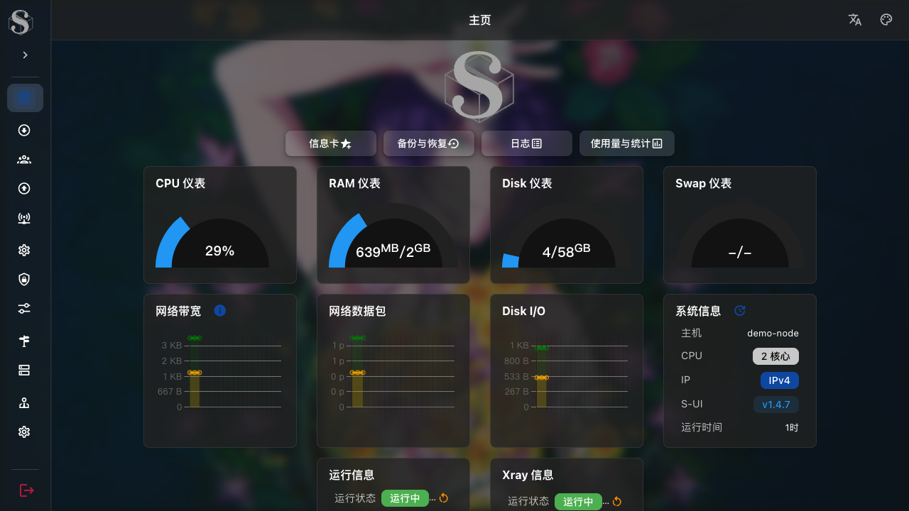
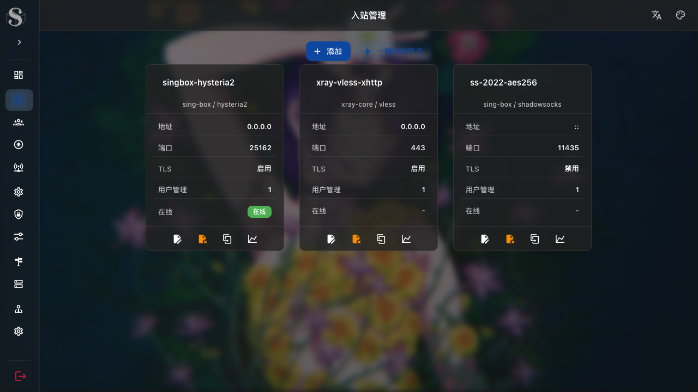
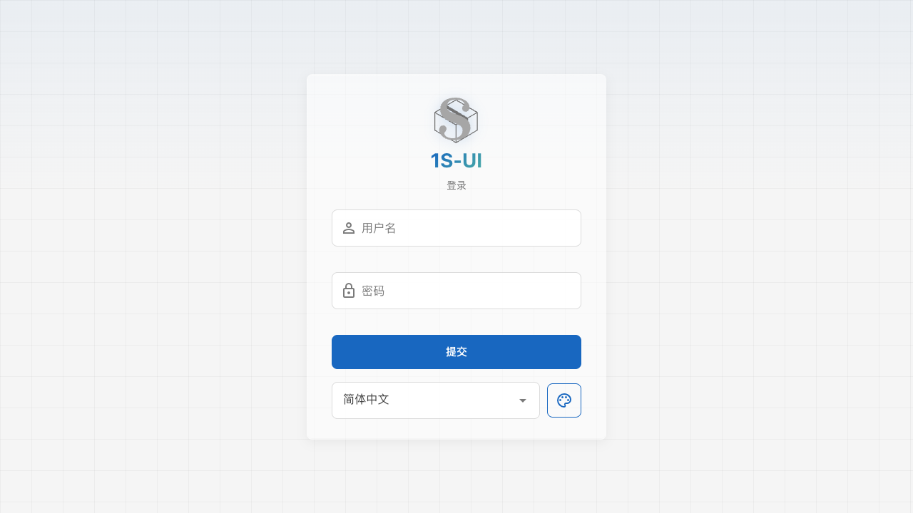

# 1S-UI

[](https://github.com/Hhz0823/1s-ui/releases/latest)
[](LICENSE)
[](go.mod)
[](frontend/package.json)
[](https://github.com/SagerNet/sing-box)
[](https://github.com/XTLS/Xray-core)

1S-UI is a modern S-UI based proxy management panel with a cleaner web interface, sing-box first runtime, optional Xray-core inbound support, TLS automation, quick node creation, v2rayN compatible links, and multi-platform releases.

1S-UI 是基于 S-UI 二次开发的现代代理管理面板，主打更清爽的 Web 页面、sing-box 默认内核、可选 Xray-core 入站、TLS 自动化、快速添加节点、v2rayN 兼容分享链接和多平台发布。

> For learning, research, and technical communication only. Please comply with local laws and regulations.
>
> 本项目仅用于学习、研究和技术交流。请遵守所在地法律法规。

**Languages:** [简体中文](#简体中文) | [English](#english) | [日本語](#日本語) | [한국어](#한국어)

---

## Screenshots / 页面截图

The screenshots use local demo data and do not contain real server secrets.

以下截图使用本地演示数据，不包含真实服务器密钥或真实节点信息。

| Dashboard / 首页 | Inbounds / 入站管理 |
| --- | --- |
|  |  |

| Login / 登录 |
| --- |
|  |

---

## 简体中文

### 项目定位

1S-UI fork 自 [alireza0/s-ui](https://github.com/alireza0/s-ui)，继续优化了页面布局、节点创建、TLS 配置、OpenWrt Lite 打包、Windows 发布、v2rayN 链接兼容和多内核运行能力。

默认运行核心是 [sing-box](https://github.com/SagerNet/sing-box)。当需要 Xray 独有能力时，例如 VLESS XHTTP、Reality、部分 Xray TLS/传输设置，可以在入站级别选择 [Xray-core](https://github.com/XTLS/Xray-core)。

### 核心特性

- 入站、出站、端点、服务、DNS、路由、用户和管理员管理
- 入站级核心选择：默认 sing-box，可选 Xray-core
- 支持 VMess、VLESS、Trojan、Shadowsocks、Hysteria2、TUIC、Naive、ShadowTLS、AnyTLS、WireGuard 等协议
- 一键添加节点，自动生成端口、标签、用户、TLS 和协议默认参数
- TLS、ACME、ECH、Reality、Pinned Peer Certificate SHA256 集中管理
- Hysteria2 / TLS 分享链接兼容 v2rayN，`pinSHA256` 按 Xray 需要输出 hex 指纹
- Shadowsocks 默认使用 `2022-blake3-aes-256-gcm` 和 256 位密码强度
- 首页仪表卡、运行状态、日志、备份恢复、使用量统计
- 响应式 Vue 3 + Vuetify 页面，支持顶部菜单、侧边栏、暗色模式和背景设置
- Linux、Windows、Docker、OpenWrt Lite 多平台发布

### 快速安装

Linux 服务器推荐使用一键脚本：

```bash
bash <(curl -Ls https://raw.githubusercontent.com/Hhz0823/1s-ui/main/install.sh)
```

安装指定版本：

```bash
bash <(curl -Ls https://raw.githubusercontent.com/Hhz0823/1s-ui/main/install.sh) v1.4.7
```

默认配置通常为：

| 配置项 | 默认值 |
| --- | --- |
| 面板端口 | `2095` |
| 面板路径 | `/app/` |
| 订阅端口 | `2096` |
| 订阅路径 | `/sub/` |
| 数据目录 | `/usr/local/s-ui/db` |

常用命令：

```bash
s-ui
s-ui status
s-ui log
s-ui update
```

### Docker

```yaml
services:
  s-ui:
    image: ghcr.io/Hhz0823/1s-ui
    container_name: s-ui
    hostname: "s-ui"
    network_mode: host
    volumes:
      - "./db:/app/db"
      - "./cert:/app/cert"
    tty: true
    restart: unless-stopped
    entrypoint: "./entrypoint.sh"
```

```bash
docker compose up -d
```

或者：

```bash
docker run -itd \
  --network host \
  -v "$PWD/db:/app/db" \
  -v "$PWD/cert:/app/cert" \
  --name s-ui \
  --restart unless-stopped \
  ghcr.io/Hhz0823/1s-ui
```

### OpenWrt Lite

OpenWrt Lite 面向路由器和低内存设备，只保留 sing-box 核心，不包含 Xray-core 运行时，以减少安装包体积和运行占用。

从 [Releases](https://github.com/Hhz0823/1s-ui/releases/latest) 下载对应架构的 `s-ui-lite_*.ipk` 后安装：

```bash
opkg install ./s-ui-lite_1.4.7-1_x86_64.ipk
/etc/init.d/s-ui-lite enable
/etc/init.d/s-ui-lite start
```

更多说明见 [docs/openwrt-lite.md](docs/openwrt-lite.md)。

### 页面功能

| 页面 | 说明 |
| --- | --- |
| 首页 | 系统仪表、运行状态、备份恢复、日志、使用量统计 |
| 入站管理 | 创建、编辑、克隆、删除入站，快速添加节点 |
| 用户管理 | 用户、流量、到期时间、分组、在线状态、二维码 |
| 出站管理 | 出站协议、拨号参数、TLS、传输层配置 |
| 节点管理 | WireGuard、Tailscale、Warp 等端点 |
| 服务管理 | CCM、OCM、DERP、SSMAPI |
| TLS 设置 | TLS、ACME、ECH、Reality、Pinned SHA256 |
| 基础信息 | 日志、实验项、全局 sing-box 配置 |
| 路由列表 | 路由规则、规则集、导入和规则动作 |
| DNS | DNS 服务器、DNS 规则、Fake-IP |
| 管理员 | 管理员账号、API Token、变更记录 |
| 设置 | 面板、订阅、网络、BBR/FQ/CAKE 等配置 |

---

## English

### Overview

1S-UI is a proxy management panel based on [S-UI](https://github.com/alireza0/s-ui). It keeps sing-box as the default runtime and adds a refined UI, quick node creation, TLS automation, v2rayN-compatible sharing links, optional Xray-core inbound support, and release packaging for several platforms.

### Features

- Manage inbounds, outbounds, endpoints, services, DNS, routes, users, and administrators
- Per-inbound core selection: sing-box by default, Xray-core when needed
- Protocols: VMess, VLESS, Trojan, Shadowsocks, Hysteria2, TUIC, Naive, ShadowTLS, AnyTLS, WireGuard, and more
- Quick node creation with generated port, tag, user, TLS, and protocol defaults
- Centralized TLS, ACME, ECH, Reality, and pinned SHA256 management
- v2rayN-compatible Hysteria2 links, including Xray-ready hex `pinSHA256`
- Shadowsocks defaults to `2022-blake3-aes-256-gcm` with 256-bit password strength
- Dashboard cards, runtime status, logs, backup and restore, usage statistics
- Responsive Vue 3 + Vuetify frontend with top menu, sidebar, dark mode, and background settings
- Linux, Windows, Docker, and OpenWrt Lite releases

### Install

```bash
bash <(curl -Ls https://raw.githubusercontent.com/Hhz0823/1s-ui/main/install.sh)
```

Install a specific version:

```bash
bash <(curl -Ls https://raw.githubusercontent.com/Hhz0823/1s-ui/main/install.sh) v1.4.7
```

Common commands:

```bash
s-ui
s-ui status
s-ui log
s-ui update
```

### Docker

```bash
docker run -itd \
  --network host \
  -v "$PWD/db:/app/db" \
  -v "$PWD/cert:/app/cert" \
  --name s-ui \
  --restart unless-stopped \
  ghcr.io/Hhz0823/1s-ui
```

### OpenWrt Lite

OpenWrt Lite targets routers and low-memory devices. It only ships the sing-box runtime and leaves Xray-core out to reduce package size and memory usage.

```bash
opkg install ./s-ui-lite_1.4.7-1_x86_64.ipk
/etc/init.d/s-ui-lite enable
/etc/init.d/s-ui-lite start
```

See [docs/openwrt-lite.md](docs/openwrt-lite.md) for architecture and packaging details.

---

## 日本語

### 概要

1S-UI は [S-UI](https://github.com/alireza0/s-ui) をベースにしたプロキシ管理パネルです。標準ランタイムは sing-box で、必要に応じて Xray-core 入站も利用できます。UI、クイックノード作成、TLS 管理、v2rayN 互換リンク、多平台リリースを強化しています。

### 主な機能

- 入站、出站、エンドポイント、サービス、DNS、ルーティング、ユーザー、管理者を管理
- 入站ごとのコア選択：標準は sing-box、必要時に Xray-core
- VMess、VLESS、Trojan、Shadowsocks、Hysteria2、TUIC、Naive、ShadowTLS、AnyTLS、WireGuard などをサポート
- クイックノード作成：ポート、タグ、ユーザー、TLS、プロトコル既定値を自動生成
- TLS、ACME、ECH、Reality、Pinned SHA256 を集中管理
- v2rayN 互換の Hysteria2 共有リンクに対応し、Xray 用 `pinSHA256` は hex 形式で出力
- ダッシュボード、実行状態、ログ、バックアップ、使用量統計
- Linux、Windows、Docker、OpenWrt Lite に対応

### インストール

```bash
bash <(curl -Ls https://raw.githubusercontent.com/Hhz0823/1s-ui/main/install.sh)
```

バージョン指定：

```bash
bash <(curl -Ls https://raw.githubusercontent.com/Hhz0823/1s-ui/main/install.sh) v1.4.7
```

### Docker

```bash
docker run -itd \
  --network host \
  -v "$PWD/db:/app/db" \
  -v "$PWD/cert:/app/cert" \
  --name s-ui \
  --restart unless-stopped \
  ghcr.io/Hhz0823/1s-ui
```

### OpenWrt Lite

OpenWrt Lite はルーターや低メモリ環境向けの軽量版です。sing-box のみを含み、Xray-core ランタイムは含まれません。

```bash
opkg install ./s-ui-lite_1.4.7-1_x86_64.ipk
/etc/init.d/s-ui-lite enable
/etc/init.d/s-ui-lite start
```

詳細は [docs/openwrt-lite.md](docs/openwrt-lite.md) を参照してください。

---

## 한국어

### 개요

1S-UI는 [S-UI](https://github.com/alireza0/s-ui)를 기반으로 한 프록시 관리 패널입니다. 기본 런타임은 sing-box이며, 필요한 경우 인바운드 단위로 Xray-core를 선택할 수 있습니다. 더 깔끔한 웹 UI, 빠른 노드 생성, TLS 자동화, v2rayN 호환 공유 링크, 다중 플랫폼 릴리스를 제공합니다.

### 주요 기능

- 인바운드, 아웃바운드, 엔드포인트, 서비스, DNS, 라우팅, 사용자, 관리자 관리
- 인바운드별 코어 선택: 기본 sing-box, 선택 Xray-core
- VMess, VLESS, Trojan, Shadowsocks, Hysteria2, TUIC, Naive, ShadowTLS, AnyTLS, WireGuard 등 지원
- 빠른 노드 생성: 포트, 태그, 사용자, TLS, 프로토콜 기본값 자동 생성
- TLS, ACME, ECH, Reality, Pinned SHA256 통합 관리
- v2rayN 호환 Hysteria2 공유 링크와 Xray용 hex `pinSHA256` 출력
- 대시보드 카드, 런타임 상태, 로그, 백업/복원, 사용량 통계
- Linux, Windows, Docker, OpenWrt Lite 릴리스 지원

### 설치

```bash
bash <(curl -Ls https://raw.githubusercontent.com/Hhz0823/1s-ui/main/install.sh)
```

특정 버전 설치:

```bash
bash <(curl -Ls https://raw.githubusercontent.com/Hhz0823/1s-ui/main/install.sh) v1.4.7
```

### Docker

```bash
docker run -itd \
  --network host \
  -v "$PWD/db:/app/db" \
  -v "$PWD/cert:/app/cert" \
  --name s-ui \
  --restart unless-stopped \
  ghcr.io/Hhz0823/1s-ui
```

### OpenWrt Lite

OpenWrt Lite는 라우터와 저메모리 장치를 위한 경량 버전입니다. 패키지 크기와 메모리 사용량을 줄이기 위해 sing-box만 포함하며 Xray-core 런타임은 포함하지 않습니다.

```bash
opkg install ./s-ui-lite_1.4.7-1_x86_64.ipk
/etc/init.d/s-ui-lite enable
/etc/init.d/s-ui-lite start
```

자세한 내용은 [docs/openwrt-lite.md](docs/openwrt-lite.md)를 참고하세요.

---

## Build From Source / 源码构建

Frontend:

```bash
cd frontend
npm install
npm run build
```

Backend:

```bash
rm -rf web/html/*
cp -R frontend/dist/* web/html/
go build -o sui main.go
```

Validation:

```bash
cd frontend && npm run build
go test ./...
```

## Runtime Paths / 运行路径

| Variable | Default | Description |
| --- | --- | --- |
| `SUI_LOG_LEVEL` | `info` | Log level |
| `SUI_DEBUG` | `false` | Debug mode |
| `SUI_DB_FOLDER` | Program `db` folder | Database directory |
| `SUI_BIN_FOLDER` | Program `bin` folder | Runtime binary directory |
| `SUI_XRAY_PATH` | `SUI_BIN_FOLDER/xray` | Xray-core binary path |
| `SUI_XRAY_CONFIG` | `SUI_BIN_FOLDER/xray.json` | Generated Xray config path |

## Directory Structure / 项目结构

```text
.
├── api/          # HTTP API
├── app/          # Application bootstrap
├── cmd/          # CLI commands and migrations
├── config/       # Version, name, and environment config
├── core/         # sing-box / Xray-core runtime
├── database/     # Database and models
├── docs/         # Documentation and screenshots
├── frontend/     # Vue 3 + Vuetify frontend
├── service/      # Business services
├── sub/          # Subscription generation
├── util/         # Link, subscription, and config utilities
├── web/          # Web server
└── windows/      # Windows installation scripts
```

## Security Notes / 安全建议

- Change the administrator username and password after installation
- Use non-default panel paths and ports
- Keep databases, private keys, certificate files, and API tokens private
- Put public panels behind HTTPS reverse proxies
- Review subscription and sharing links before sending them to others

## Credits / 鸣谢

- [SagerNet/sing-box](https://github.com/SagerNet/sing-box)
- [XTLS/Xray-core](https://github.com/XTLS/Xray-core)
- [alireza0/s-ui](https://github.com/alireza0/s-ui)
- Everyone who tests, reports issues, and contributes feedback

## License / 许可证

This project is released under the [GPL-3.0](LICENSE) license.
