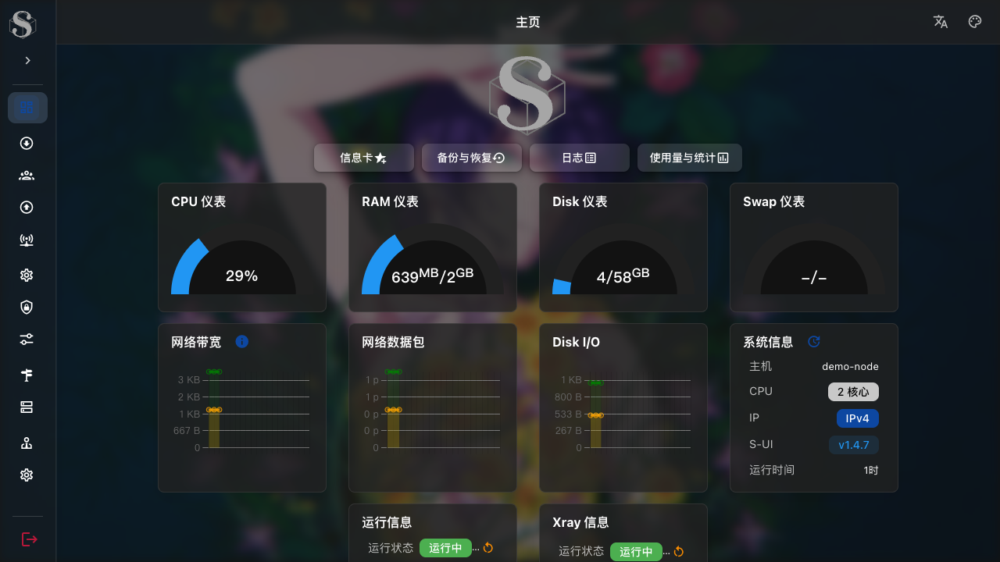
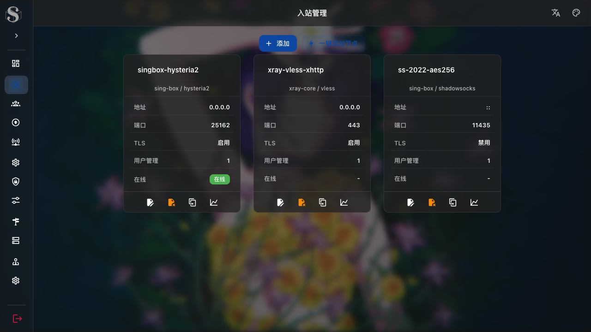
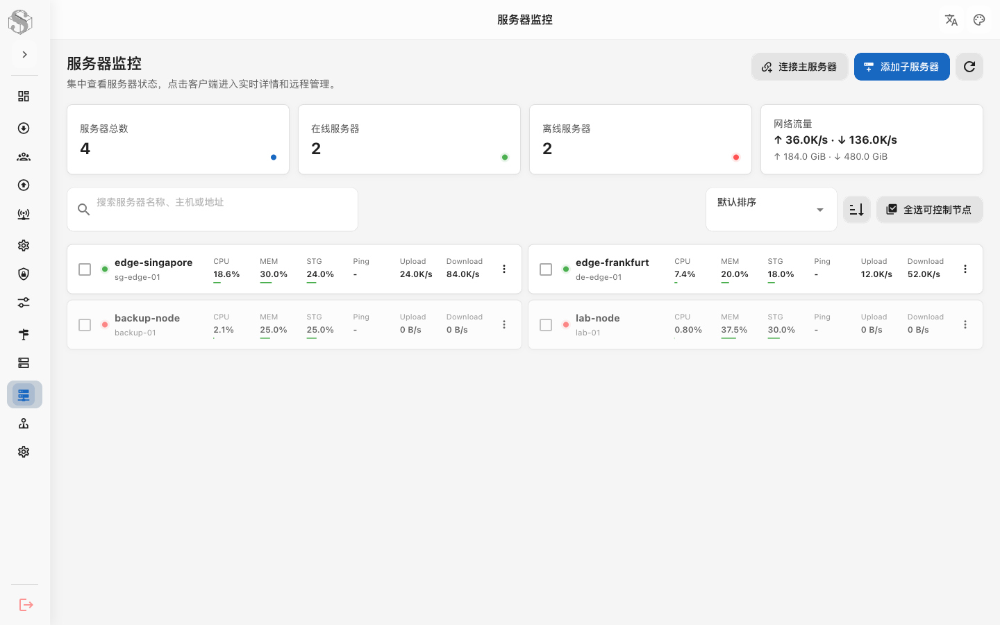
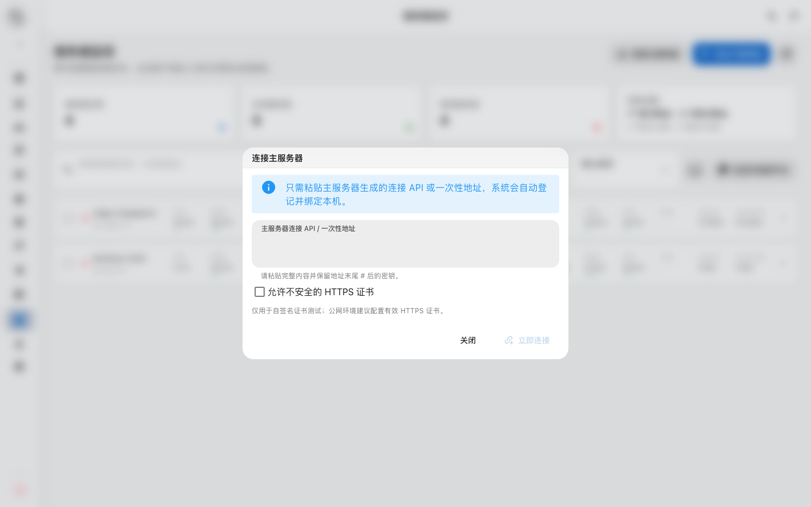
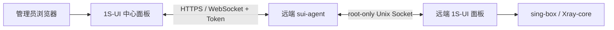

<div align="center">
  
  <h1>1S-UI</h1>
  <p><strong>Linux-first sing-box / Xray-core proxy panel with multi-server monitoring and remote management.</strong></p>
  <p>面向 Ubuntu / Debian 的现代代理管理面板：双内核、批量节点、IPv6 中转、TLS 自动化、服务器监控与远程控制。</p>

  [](https://github.com/Hhz0823/1s-ui/releases/latest)
  [](https://github.com/Hhz0823/1s-ui/actions/workflows/security.yml)
  [](https://github.com/Hhz0823/1s-ui/actions/workflows/docker.yml)
  [](LICENSE)
  [](go.mod)
  [](frontend/package.json)

  **[Linux v1.5.8](https://github.com/Hhz0823/1s-ui/releases/tag/v1.5.8)** · **[OpenWrt Lite v1.5.7](https://github.com/Hhz0823/1s-ui/releases/tag/v1.5.7)** · **[Issues](https://github.com/Hhz0823/1s-ui/issues)**
</div>

> 1S-UI 基于 [alireza0/s-ui](https://github.com/alireza0/s-ui) 二次开发，仅用于学习、研究与技术交流。请遵守当地法律法规。
> 1S-UI is a fork of [S-UI](https://github.com/alireza0/s-ui), provided for learning and research. Comply with local laws.

**语言 Languages:** [简体中文](#简体中文) · [English](#english) · [日本語](#日本語) · [한국어](#한국어) · [Tiếng Việt](#tiếng-việt) · [فارسی](#فارسی)

**导航:** [页面截图](#页面截图) · [快速安装](#快速安装) · [功能矩阵](#功能矩阵) · [服务器监控](#服务器监控) · [一键中转](#一键中转) · [Docker](#docker) · [安全](#安全与权限)

---

## 页面截图

截图来自 v1.5.8 默认实色主题，不包含账号密码、Token、证书私钥或节点密钥。

| 首页 Dashboard | 入站管理 Inbounds |
| --- | --- |
|  |  |

| 服务器监控 Server Agents | 连接主服务器 Connect Controller |
| --- | --- |
|  |  |

| 实时指标 Live Metrics | 远程入站 Remote Inbounds |
| --- | --- |
|  |  |

---

## 快速安装

### 先选择安装模式

| 模式 | 命令参数 | 安装内容 | 适用场景 |
| --- | --- | --- | --- |
| **轻量 Web 面板** | `--minimal` | 完整 Web UI + sing-box | 单机代理、低配 VPS；性能目标 1 核 512MB |
| **受管客户端** | `--managed-client` | Web UI + sing-box + Agent | 被中心面板管理的客户端服务器 |
| **只监控 Agent** | `install-agent.sh` | 独立 Agent，无 Web UI | 只采集指标，不需要远程管理入站 |
| **全面服务端** | `--full` | Web UI + sing-box + Xray + Agent + 反向代理 | 多服务器控制面；硬性要求至少 2 核 2GB |

```bash
# 推荐：交互选择安装模式
bash <(curl -Ls https://raw.githubusercontent.com/Hhz0823/1s-ui/main/install.sh)

# 轻量模式，自动确认
bash <(curl -Ls https://raw.githubusercontent.com/Hhz0823/1s-ui/main/install.sh) v1.5.8 -y --minimal

# 全面服务端 + Caddy HTTPS
bash <(curl -Ls https://raw.githubusercontent.com/Hhz0823/1s-ui/main/install.sh) v1.5.8 -y --full --domain panel.example.com --email admin@example.com
```

### 30 秒接入子服务器

1. 在主面板打开 **服务器监控 → 添加子服务器 → 生成主服务器连接 API**。
2. 在子服务器打开 **服务器监控 → 连接主服务器**，粘贴完整连接 API，点击 **立即连接**。

系统会按子服务器主机名自动登记，并为每台机器签发独立 Agent Token。无需手动填写 WebSocket 地址、节点名称或 Token：

- 子服务器已经安装 1S-UI：打开 **服务器监控 → 连接主服务器**，粘贴完整连接 API 即可。
- 全新服务器：执行同一弹窗生成的“受管客户端安装命令”，安装完成后自动绑定。
- 一个连接 API 可连续接入多台子服务器；重新生成后旧 API 立即失效。
- 只接入一台服务器时，也可在同一弹窗创建 15 分钟有效、仅使用一次的地址。
- HTTP/IP 面板也可使用复制按钮；浏览器不提供安全剪贴板 API 时会自动使用兼容复制方式。

带完整 Web 面板、可远程管理入站的受管客户端：

```bash
bash <(curl -Ls https://raw.githubusercontent.com/Hhz0823/1s-ui/main/install.sh) v1.5.8 -y \
  --managed-client \
  --connect 'https://panel.example.com/app/agent/v1/enroll#CONTROLLER_KEY'
```

只采集监控指标、不安装子服务器 Web 面板：

```bash
bash <(curl -fsSL https://raw.githubusercontent.com/Hhz0823/1s-ui/main/install-agent.sh) \
  --connect 'https://panel.example.com/app/agent/v1/enroll#CONTROLLER_KEY'
```

> `#CONTROLLER_KEY` 必须保留。密钥位于 URL Fragment，不会随 HTTP 请求发送到服务端访问日志。

### 安装后的访问地址

| 安装结果 | 面板地址 |
| --- | --- |
| 轻量 / 受管客户端，未启用反代 | `http://服务器IP:2095/app/` |
| 全面服务端，未填写域名 | `http://服务器IP/app/` |
| 全面服务端，Caddy + 域名 | `https://你的域名/app/` |

全面服务端启用反向代理后，面板默认只监听 `127.0.0.1:2095`。公网应访问 80/443 的 `/app/`，公网 `IP:2095` 不可访问属于预期安全行为。

| 配置 | 默认值 |
| --- | --- |
| 管理账号 | `admin` / `admin`，首次登录后请立即修改 |
| 面板 | `2095` · `/app/` |
| 订阅 | `2096` · `/sub/` |
| 数据目录 | `/usr/local/s-ui/db` |

```bash
s-ui
s-ui status
s-ui log
s-ui update
```

---

## 简体中文

### 项目定位

1S-UI 以 **sing-box 为默认内核**，并允许每条入站独立选择 **Xray-core**。当前开发优先级是 Linux（Ubuntu / Debian）；Windows 暂停维护，OpenWrt Lite 暂停在 v1.5.7 且仅使用 sing-box。

低配策略以“系统不因安装或启动面板发生 OOM/重启”为第一优先级：

- 1 核会启用低开销运行参数，但不会单独阻止 sing-box。
- 内存低于 1.5GB 时，安装器默认启动 Web 面板和 sing-box，并使用较低启动预算；仅显式传入 `--skip-core` 才进入纯面板模式。
- 低配档位不下载、不启动 Xray-core，并设置 `SUI_DISABLE_XRAY=true`。
- 作为主服务器创建、管理 Agent 的控制面需要至少 2 核 2GB；受管客户端本身可按低配模式安装。`--force` 不会绕过主控制面的限制。
- 512MB 目标包含轻量 Web 管理和 sing-box 基础代理；代理吞吐仍取决于协议、连接数和线路。

### 功能矩阵

| 模块 | 能力 |
| --- | --- |
| 面板 | 入站、出站、端点、服务、DNS、路由、用户、管理员、订阅、日志、备份与流量统计 |
| 双内核 | 入站级 `sing-box` / `xray` 选择，独立配置生成和运行状态 |
| 快速创建 | 一次创建 1–100 条节点，连续端口、标签、用户、TLS 和安全默认值 |
| TLS | ACME、ECH、Reality、Pinned Certificate SHA256、证书生成与集中管理 |
| 分享与订阅 | Clash、JSON、标准 URI；v2rayN 7.23.4 实机验证 |
| 一键中转 | IPv6 出口池或上游 SOCKS5，自动创建入站、出站、用户和路由 |
| 服务器监控 | 多服务器列表、CPU/内存/磁盘/负载/进程/流量、RTT、P95、丢包和历史曲线 |
| 远程管理 | 修改服务器名称、远程入站 CRUD、1–100 快速节点、IPv6 中转、批量指令和 PTY 终端 |
| 界面 | 默认实色；可选玻璃/清透、自定义背景、模糊、菜单布局和紧凑密度 |
| 反向代理 | 在服务端面板查看和管理 Caddy / Nginx 状态、域名与配置应用 |

#### sing-box 入站

`Mixed`、`SOCKS`、`HTTP`、`Shadowsocks`、`VMess`、`Trojan`、`VLESS`、`Hysteria2`、`ShadowTLS`、`TUIC`、`Naive`、`AnyTLS`、`Direct`。

Shadowsocks 快速创建默认使用 `2022-blake3-aes-256-gcm`。

#### Xray-core 入站与传输

| 类型 | 已支持 |
| --- | --- |
| 入站 | VLESS、VMess、Trojan、Shadowsocks、SOCKS、HTTP、Mixed、Hysteria2、Dokodemo-door、WireGuard |
| 传输 | XHTTP、RAW/TCP、mKCP、gRPC、WebSocket、HTTPUpgrade、Hysteria2 transport |
| TLS / 伪装 | TLS、Reality、XHTTP、Hysteria2 masquerade |
| 自检 | 二进制版本、配置校验、运行状态、协议和传输能力矩阵 |

Xray 上游已移除旧 HTTP/2 和 QUIC transport，请使用 XHTTP `stream-one` / H3。Xray Hysteria2 建议使用 Xray-core `26.7.11` 或更新版本。

### 服务器监控


```mermaid
flowchart LR
    A["管理员浏览器"] --> B["1S-UI 中心面板"]
    B <-->|"HTTPS / WebSocket + Token"| C["远端 sui-agent"]
    C <-->|"root-only Unix Socket"| D["远端 1S-UI 面板"]
    D --> E["sing-box / Xray-core"]
```

Agent 主动出站连接中心面板，远端无需开放 Agent 控制端口：

- 主面板可生成一个可复用连接 API，子服务器只需粘贴这一项；主机名、节点登记和独立 Agent Token 均自动完成。
- 连接密钥放在 URL `#` 片段中，不进入 HTTP 访问日志；重新生成连接 API 会立即撤销旧密钥。
- 单台服务器仍可选择 15 分钟、一次性的配对地址。
- WebSocket 长连接负责实时指标、命令、交互终端和控制面 RTT。
- WS 暂时断开时回退到 HTTP `/agent/v1/heartbeat`，之后自动重连。
- CPU 使用整个心跳周期的累计时间差计算，避免空闲 VPS 被 200ms 瞬时采样长期显示为 0。
- 一个 Agent 代表一台服务器，一台受管服务器可以包含多条入站。
- 远程入站变更由客户端本地面板校验并应用，不直接修改远端 SQLite。
- 绑定成功后主面板为每台子服务器签发独立 Agent Token；Token 仅保存在子服务器权限 `0600` 的 `/etc/default/1s-ui-agent`。
- 远程 Shell 和 PTY 权限等同 Agent 的系统用户，通常是 root，请严格保护面板账号。

### 一键中转

| 项目 | 支持 |
| --- | --- |
| 来源 | 本机公网 IPv6 池、上游 SOCKS5 |
| 协议 | SOCKS5、HTTP、Mixed、Shadowsocks、VLESS、VMess、Trojan、Hysteria2、TUIC、Naive、AnyTLS |
| 批量 | 每批 1–100 条；已用端口自动跳过并继续分配 |
| 导出 | BitBrowser Excel、纯文本 `IP:端口:账号:密码` |
| IPv6 连接方式 | 客户端连接原 VPS IPv4/域名，每条代理仅绑定对应 IPv6 出口 |

IPv6 池模式只会向选定网卡添加地址，不修改系统默认路由。每个地址都经过 DAD 和公网出口验证，失败会回滚。VPS 必须拥有服务商已路由或授权的 IPv6 前缀；仅添加随机 `/64` 地址无法绕过源地址过滤。

实现参考 [help660vip/auto-add-ipv6](https://github.com/help660vip/auto-add-ipv6) 的流程，但 1S-UI 使用内置 Go 逻辑，不执行第三方远程脚本。

### v1.5.8 更新重点

- 增加可复用的主服务器连接 API：子服务器只粘贴一个值即可自动登记、获取独立 Token 并建立 WebSocket；重新生成会撤销旧 API。
- 增加 15 分钟一次性连接地址，并区分“完整 Web 面板受管客户端”和“仅监控 Agent”安装方式。
- 修复 HTTP/IP 面板中复制按钮失败的问题，在非安全上下文自动回退到兼容剪贴板方案。
- 全新的服务器监控列表和节点详情页，提供实时指标、历史曲线、网络流量和远程控制标签页。
- 修复低负载 Linux VPS 的 CPU 长期显示 `0.0%`，小于 1% 时显示两位小数。
- 修复节点详情页在桌面和移动端无法继续下滑的问题。
- 受管客户端支持远程入站 CRUD、1–100 快速创建和 IPv6 / 上游 SOCKS5 中转。
- 修复 HY2、TUIC、AnyTLS、VLESS、Trojan、VMess、Naive 分享链接在 v2rayN 的转义、TLS 钉扎和传输兼容。
- 增加服务端反向代理管理、Xray 自检与 WireGuard / Hysteria2 / Dokodemo-door 配置生成。
- Linux Release 提供 `amd64`、`arm64`、`armv5`、`armv6`、`armv7`、`386`、`s390x` 七种架构包。

---

## English

1S-UI is a Linux-focused proxy panel with sing-box as the default core and optional Xray-core selection per inbound.

### Highlights

- Complete Web UI for inbounds, outbounds, endpoints, routing, DNS, users, subscriptions, TLS, logs, backup, and traffic.
- 1–100 node quick creation with safe protocol defaults and automatic used-port skipping.
- sing-box plus Xray protocols including XHTTP, RAW, gRPC, WebSocket, Hysteria2, Dokodemo-door, and WireGuard.
- IPv6 egress pools and upstream SOCKS5 relays with BitBrowser Excel/plain-text export.
- Outbound Agent connections over WebSocket/HTTP; no inbound Agent control port is required.
- A reusable controller connection API lets each child panel bind by pasting one value; optional 15-minute single-use links remain available.
- Each child is registered by hostname and receives its own Agent token; regenerating the controller API revokes the previous key.
- Clipboard actions also work on HTTP/IP panels through a compatibility fallback when the secure Clipboard API is unavailable.
- Live CPU, memory, disk, process, network, RTT/P95/loss metrics, history charts, remote commands, and PTY terminal.
- Managed-server inbound CRUD, remote quick-add, and remote relay creation through a root-only Unix socket.
- Default solid UI, responsive desktop/mobile layouts, optional backgrounds and glass/clear styles.

### Resource profiles

| Profile | Minimum target | Notes |
| --- | --- | --- |
| Minimal panel | 1 vCPU / 512MB | Full Web UI + sing-box; Xray remains disabled on low-resource hosts |
| Managed client | 1 vCPU / 512MB | Full Web UI + sing-box + Agent; generated enrollment command recommended |
| Full control plane | 2 vCPU / 2GB | Hard requirement; includes Xray, Agent, and reverse proxy |

The 2 vCPU / 2GB hard requirement applies to a panel acting as the Agent control plane. Managed child panels can use the low-resource profile and start sing-box by default; only an explicit `--skip-core` leaves proxy cores stopped.

Quick install:

```bash
bash <(curl -Ls https://raw.githubusercontent.com/Hhz0823/1s-ui/main/install.sh)
```

To attach a child server, generate a controller connection API under **Server Monitoring → Add Child Server**, then paste that single value into **Server Monitoring → Connect to Controller** on the child. For a fresh managed child with a full Web panel:

```bash
bash <(curl -Ls https://raw.githubusercontent.com/Hhz0823/1s-ui/main/install.sh) v1.5.8 -y \
  --managed-client \
  --connect 'https://panel.example.com/app/agent/v1/enroll#CONTROLLER_KEY'
```

Defaults: admin `admin` / `admin` (change immediately), panel `2095` `/app/`, subscription `2096` `/sub/`, database `/usr/local/s-ui/db`.

With the full reverse-proxy profile, use `http://server-ip/app/` or `https://your-domain/app/`. Port `2095` is intentionally bound to localhost.

---

## 日本語

1S-UI は Ubuntu / Debian 向けのプロキシ管理パネルです。標準コアは sing-box、入站ごとに Xray-core を選択できます。v1.5.8 は 1–100 件の一括ノード作成、IPv6 出口中継、サーバー Agent 監視、履歴グラフ、遠隔操作、PTY ターミナル、Caddy / Nginx 管理に対応します。子サーバーは、メインパネルで生成した接続 API を 1 つ貼り付けるだけで登録できます。

```bash
bash <(curl -Ls https://raw.githubusercontent.com/Hhz0823/1s-ui/main/install.sh) v1.5.8
```

Linux が主なサポート対象です。Windows は保守停止中、OpenWrt Lite は sing-box 専用 v1.5.7 を継続します。

## 한국어

1S-UI는 Ubuntu/Debian 중심의 프록시 관리 패널입니다. 기본 코어는 sing-box이며 인바운드별로 Xray-core를 선택할 수 있습니다. v1.5.8은 1–100개 노드 일괄 생성, IPv6 출구 릴레이, 서버 Agent 모니터링, 기록 차트, 원격 제어, PTY 터미널 및 Caddy/Nginx 관리를 지원합니다. 자식 서버는 메인 패널에서 생성한 연결 API 하나만 붙여 넣으면 등록됩니다.

```bash
bash <(curl -Ls https://raw.githubusercontent.com/Hhz0823/1s-ui/main/install.sh) v1.5.8
```

## Tiếng Việt

1S-UI là bảng điều khiển proxy ưu tiên Ubuntu/Debian, dùng sing-box mặc định và cho phép chọn Xray-core theo từng inbound. Phiên bản v1.5.8 hỗ trợ tạo hàng loạt 1–100 node, relay IPv6, giám sát Agent, biểu đồ lịch sử, điều khiển từ xa và terminal PTY. Máy con chỉ cần dán một API kết nối do bảng điều khiển chính tạo để đăng ký.

```bash
bash <(curl -Ls https://raw.githubusercontent.com/Hhz0823/1s-ui/main/install.sh) v1.5.8
```

## فارسی

1S-UI یک پنل مدیریت پروکسی برای Ubuntu و Debian است. هسته پیش‌فرض sing-box است و برای هر inbound می‌توان Xray-core را انتخاب کرد. نسخه v1.5.8 ساخت گروهی ۱ تا ۱۰۰ نود، خروجی IPv6، پایش Agent، نمودارهای زنده، کنترل از راه دور و ترمینال PTY را پشتیبانی می‌کند. برای ثبت سرور فرزند کافی است تنها API اتصال ساخته‌شده در پنل اصلی را وارد کنید.

```bash
bash <(curl -Ls https://raw.githubusercontent.com/Hhz0823/1s-ui/main/install.sh) v1.5.8
```

---

## Docker

```bash
docker run -d \
  --network host \
  -v "$PWD/db:/app/db" \
  -v "$PWD/cert:/app/cert" \
  --name s-ui \
  --restart unless-stopped \
  ghcr.io/Hhz0823/1s-ui
```

Docker Compose:

```yaml
services:
  s-ui:
    image: ghcr.io/Hhz0823/1s-ui
    container_name: s-ui
    network_mode: host
    volumes:
      - ./db:/app/db
      - ./cert:/app/cert
    restart: unless-stopped
    entrypoint: ./entrypoint.sh
```

## OpenWrt Lite

OpenWrt Lite 暂停在 v1.5.7，仅包含 sing-box。当前开发优先更新 Linux，不更新 OpenWrt 插件。

```bash
opkg install ./s-ui-lite_1.5.7-1_x86_64.ipk
/etc/init.d/s-ui-lite enable
/etc/init.d/s-ui-lite start
```

详见 [docs/openwrt-lite.md](docs/openwrt-lite.md)。

## 源码构建

开发构建需要 Go、Node.js/npm、C 编译器和 rsync：

```bash
cd frontend
npm ci
npm run build
cd ..
mkdir -p web/html
rsync -a --delete frontend/dist/ web/html/
go build -o sui .
go build -o sui-agent ./cmd/sui-agent
```

验证：

```bash
go test ./...
go test -tags openwrt_lite ./...
go vet ./...
cd frontend && npm run build
```

正式 Release 使用 GitHub Actions 构建带 CGO、musl 和 Naive 支持的 Linux 多架构包；普通本地 `go build` 不等同于正式 Release 构建。

## 目录结构

```text
api/          HTTP API、Agent 控制桥接、终端 WebSocket
agent/        Agent 指标、命令、连接与 PTY
app/          应用启动
cmd/          CLI、独立 sui-agent、迁移工具
config/       版本和环境配置
core/         sing-box / Xray 运行时
database/     SQLite 和模型
docs/         文档与页面截图
frontend/     Vue 3 + Vuetify
service/      核心业务、配置生成、Agent Hub
sub/          订阅服务
util/         分享链接和配置工具
web/          Web 服务与嵌入式前端
windows/      Windows 脚本（暂停维护）
```

## 环境变量

| 变量 | 默认 | 说明 |
| --- | --- | --- |
| `SUI_LOG_LEVEL` | `info` | 日志级别 |
| `SUI_DEBUG` | `false` | 调试模式 |
| `SUI_DB_FOLDER` | 程序目录下 `db` | 数据库目录 |
| `SUI_BIN_FOLDER` | 程序目录下 `bin` | 运行时二进制目录 |
| `SUI_XRAY_PATH` | `$SUI_BIN_FOLDER/xray` | Xray 二进制路径 |
| `SUI_XRAY_CONFIG` | `$SUI_BIN_FOLDER/xray.json` | Xray 配置路径 |
| `SUI_DISABLE_XRAY` | `false` | 禁止启动 Xray 和创建 Xray 入站；低配安装器自动设置 |

## 安全与权限

1. 首次登录后立即修改默认管理员密码。
2. 公网控制面使用 HTTPS，并限制面板访问来源。
3. 妥善保护数据库、证书、私钥、管理员 Token 和 Agent Token。
4. 主服务器连接 API、一次性地址和 Agent Token 都属于敏感凭据；不要截图公开，连接 API 泄露后应立即重新生成。
5. 远程 Shell / PTY 权限等同 Agent 系统用户，通常是 root。
6. 定期备份 `/usr/local/s-ui/db`，升级前保留可回滚副本。
7. 不要为 IPv6 中转修改系统默认路由；使用面板内置的源地址绑定和验证流程。

## Credits

- [SagerNet/sing-box](https://github.com/SagerNet/sing-box)
- [XTLS/Xray-core](https://github.com/XTLS/Xray-core)
- [alireza0/s-ui](https://github.com/alireza0/s-ui)
- 所有参与测试与反馈的用户

## License

[GPL-3.0](LICENSE)
