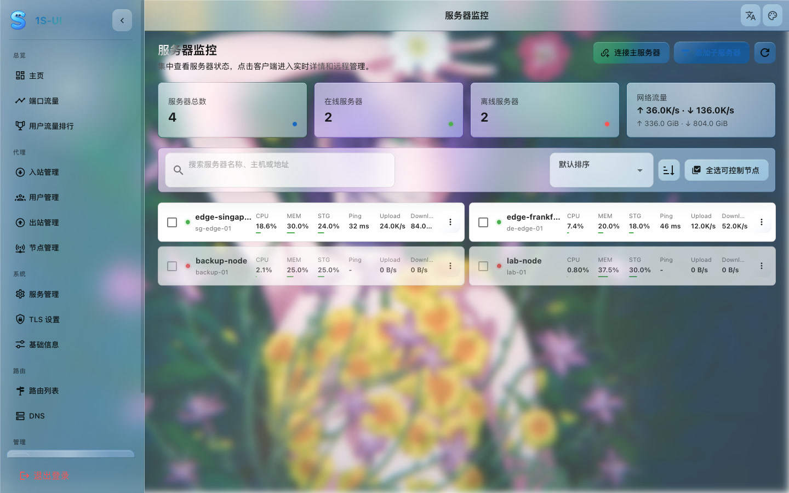
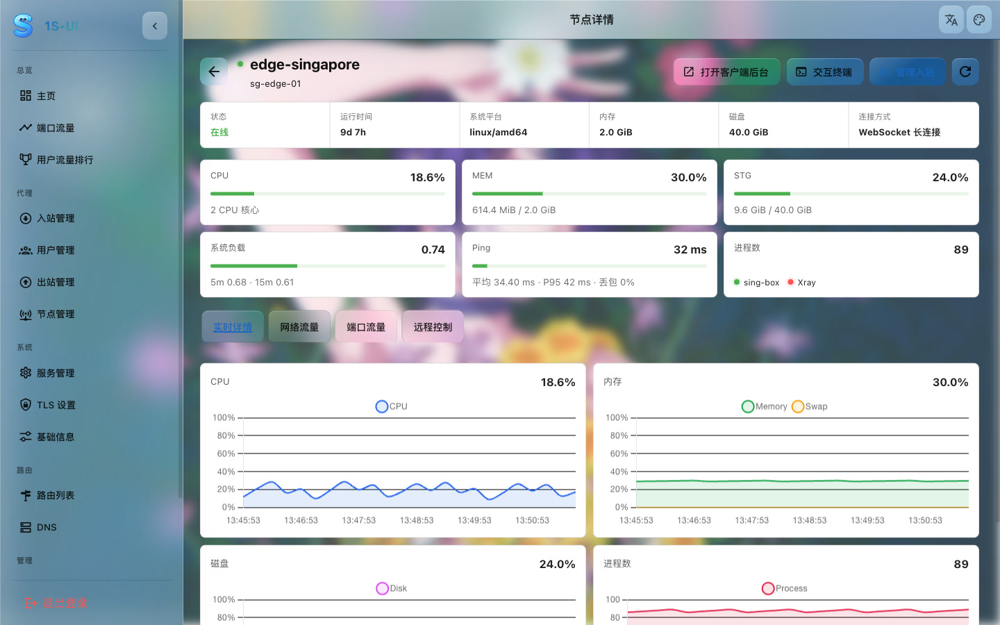
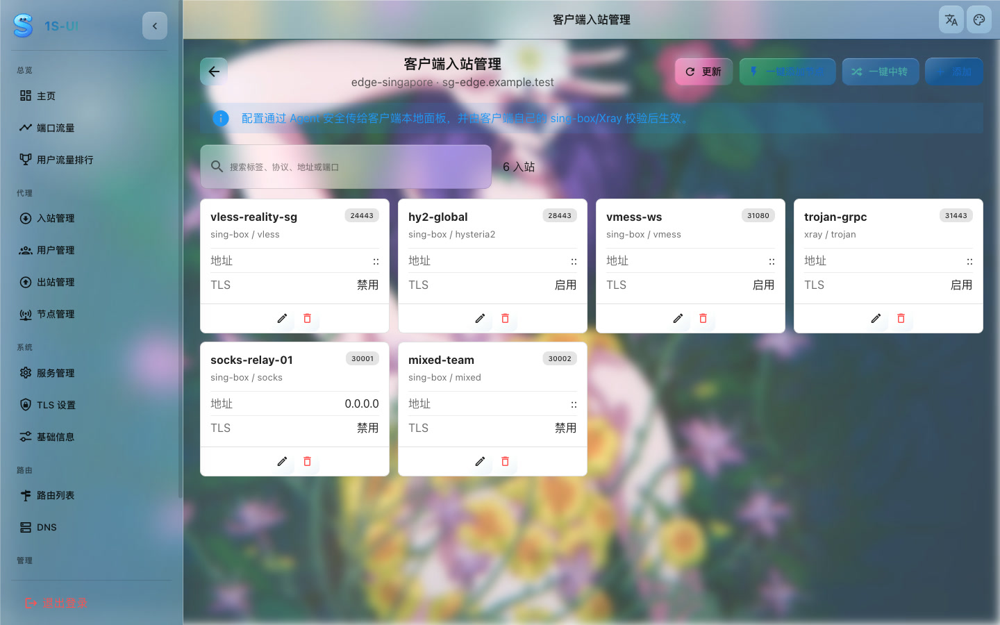
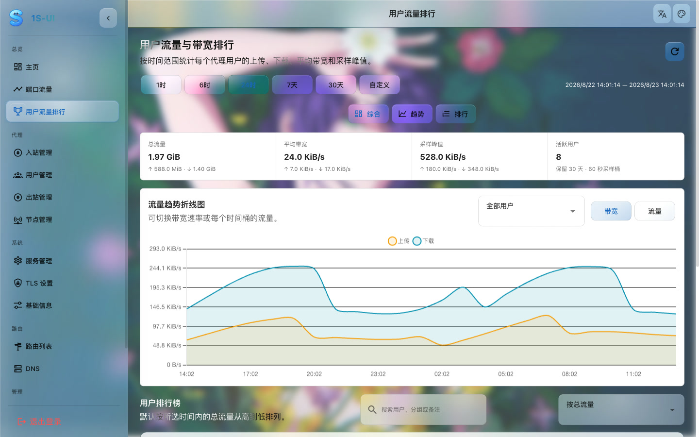
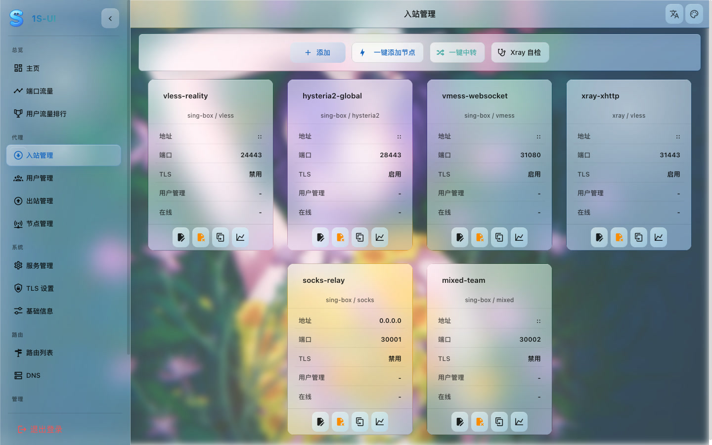
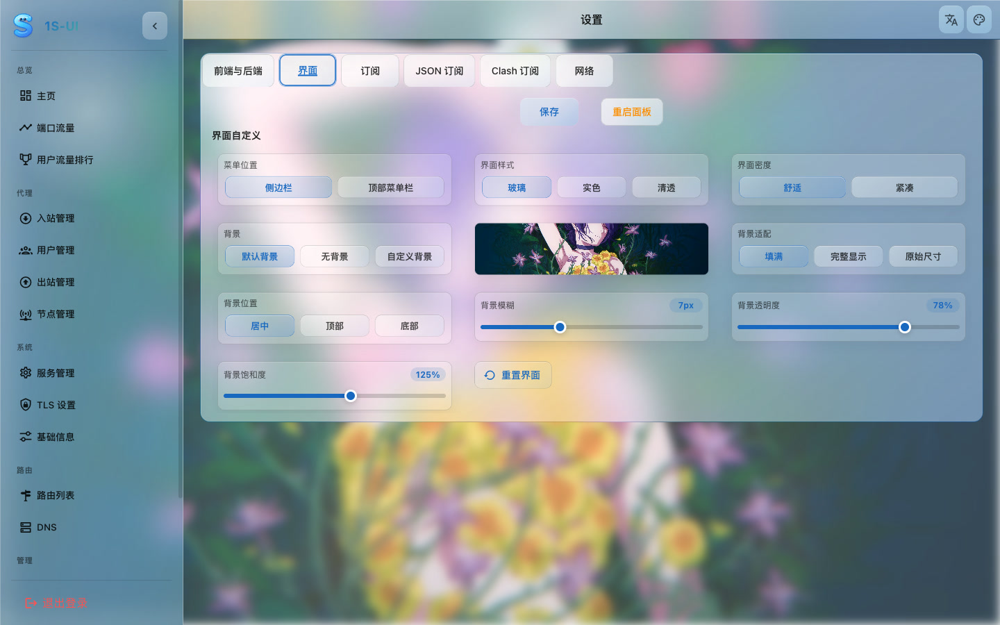
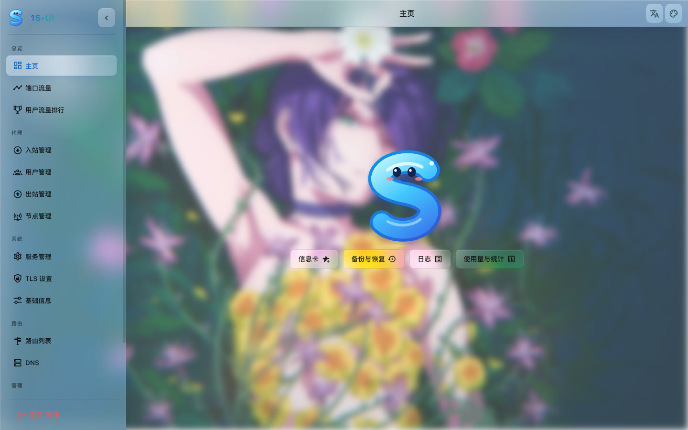
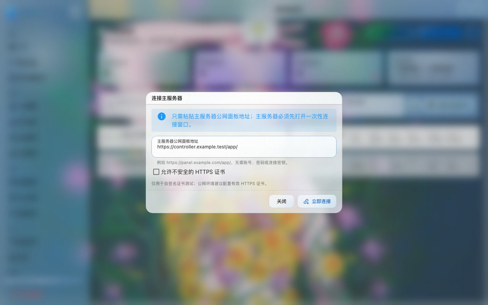
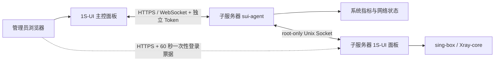
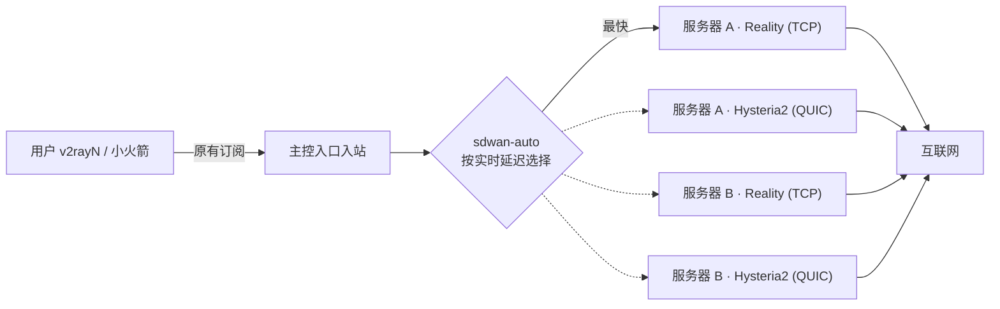

<div align="center">
  
  <h1>1S-UI</h1>
  <p><strong>Linux multi-server control plane for sing-box / Xray-core.</strong></p>
  <p>面向 Ubuntu / Debian 的代理服务器群控面板：一个主控集中纳管多台 VPS，统一监控、远程管理入站、批量创建节点与配置 IPv6 中转。</p>

  [](https://github.com/Hhz0823/1s-ui/releases/latest)
  [](https://github.com/Hhz0823/1s-ui/actions/workflows/security.yml)
  [](https://github.com/Hhz0823/1s-ui/actions/workflows/docker.yml)
  [](LICENSE)
  [](backend/go.mod)
  [](frontend/package.json)

  **[Linux v1.6.2](https://github.com/Hhz0823/1s-ui/releases/tag/v1.6.2)** · **[OpenWrt Lite v1.5.7](https://github.com/Hhz0823/1s-ui/releases/tag/v1.5.7)** · **[Issues](https://github.com/Hhz0823/1s-ui/issues)**
</div>

> 1S-UI 基于 [alireza0/s-ui](https://github.com/alireza0/s-ui) 二次开发，仅用于学习、研究与技术交流。请遵守当地法律法规。
> 1S-UI is a fork of [S-UI](https://github.com/alireza0/s-ui), provided for learning and research. Comply with local laws.

**语言 Languages:** [简体中文](#简体中文) · [English](#english) · [日本語](#日本語) · [한국어](#한국어) · [Tiếng Việt](#tiếng-việt) · [فارسی](#فارسی)

**导航:** [页面截图](#页面截图) · [群控架构](#群控架构) · [快速部署](#快速部署) · [功能矩阵](#功能矩阵) · [群控与远程管理](#群控与远程管理) · [一键中转](#一键中转) · [SD-WAN 智能组网](#sd-wan-智能组网) · [客户端导入](#客户端导入兼容性) · [安全](#安全与权限)

---

## 页面截图

截图来自 `v1.6.0-boost` 默认液态玻璃主题。服务器、域名、地址和指标均为演示数据，不包含账号密码、Token、证书私钥、真实服务器 IP 或节点密钥。

| 服务器群控 Server Fleet | 节点实时指标 Live Metrics |
| --- | --- |
|  |  |

| 远程入站 Remote Inbounds | 用户流量排行 User Traffic |
| --- | --- |
|  |  |

| 本机入站 Local Inbounds | 界面自定义 Appearance |
| --- | --- |
|  |  |

| 液态玻璃主页 Glass Home | 接入主控 Connect Controller |
| --- | --- |
|  |  |

---

## 群控架构

1S-UI 将单机代理面板和多服务器控制面合并在同一套安装包中。每台服务器默认先作为独立客户端运行；选择其中一台切换为主控后，即可从一个 Web 面板集中查看和管理其它服务器。

| 形态 | 适用场景 | 能力 | 资源策略 |
| --- | --- | --- | --- |
| **完整主控制端** | 集中管理多台 VPS | 服务器列表、实时与历史指标、端口流量、远程入站 CRUD、批量建节点、IPv6 / SOCKS5 中转、命令和 PTY | 至少 2 核 2GiB |
| **仅监控主控** | 只看服务器状态 | 在线状态、CPU、内存、磁盘、负载、进程、网络、RTT、P95、丢包和端口流量 | 至少 2 核 2GiB；后端拒绝远程控制 |
| **受管客户端** | 被主控纳管，同时保留本机面板 | 完整 Web UI、sing-box 默认内核、可选 Xray、本机节点与主动出站 Agent | 目标 1 核 512MiB |


```mermaid
flowchart LR
    A["管理员浏览器"] --> B["1S-UI 主控面板"]
    B <-->|"HTTPS / WebSocket + 独立 Token"| C["子服务器 sui-agent"]
    C --> D["系统指标与网络状态"]
    C <-->|"root-only Unix Socket"| E["子服务器 1S-UI 面板"]
    E --> F["sing-box / Xray-core"]
    A -.->|"HTTPS + 60 秒一次性登录票据"| E
```

- Agent 从子服务器主动连接主控，子服务器无需额外开放 Agent 控制端口。
- 每台子服务器拥有独立 Token；主控不会共用一个永久连接密钥。
- 远程入站操作由子服务器本机面板校验并应用，主控不会直接写入远端 SQLite。
- 主控可随时切换为仅监控角色，远程终端、命令、入站和中转权限会在后端统一关闭。
- 单机用户无需启用群控角色，仍可把 1S-UI 作为完整的本地代理管理面板使用。

---

## 快速部署

### 群控最短路径

1. 在主服务器和每台子服务器执行同一个安装命令。
2. 主服务器首次进入 Web 向导，创建管理员并选择 **完整主控制端** 或 **仅监控**。
3. 主服务器点击 **服务器监控 → 添加子服务器**，打开 5 分钟单次连接窗口。
4. 子服务器首次进入 Web 向导，选择默认的 **客户端**，创建本机管理员并粘贴主服务器公网面板地址。
5. 以后可从主控节点详情点击 **打开客户端后台**，无需输入子服务器管理员密码。

### 统一安装

安装脚本不再要求选择类型。默认安装独立前端产物、Go API 后端、sing-box 和 Agent 文件；nginx 托管静态前端并把 API/WS 反代到 `127.0.0.1:2097`，Agent 未绑定主服务器时保持禁用，不占用后台进程。历史订阅服务继续使用 `2096`，与内部 API 端口隔离。
首次打开面板会进入新手向导，由你在浏览器中选择运行角色、创建管理员账号，并可直接填写主服务器公网面板地址完成客户端绑定。右上角可跳过说明页并直达必要设置；管理员账号不可跳过。SSH 安装过程不再询问凭据，也不存在默认 Web 密码。

安装后默认运行在 **客户端模式**：Web 面板、sing-box 和本机节点功能完整可用，但 Agent 注册、心跳与远程控制入口保持关闭。需要集中管理其它服务器时，可在 **设置 → 服务端面板 → 运行角色** 选择 **完整主控制端** 或 **仅监控**；两种服务端角色都会再次校验 2 核 CPU 与 2 GiB 内存。仅监控模式只开放 Agent 注册、心跳、指标和端口流量，后端会拒绝终端、命令、远程入站和中转操作。旧版已经管理 Agent 的面板会自动继承完整主控制端状态，不会因升级断开。

```bash
bash <(curl -Ls https://raw.githubusercontent.com/Hhz0823/1s-ui/main/install.sh)
```

这是面向新用户保留的唯一 Linux 安装指令。角色切换、Xray-core 可选安装、反向代理和主控绑定均在 Web 面板完成；脚本仍兼容旧版自动化参数，但不再把它们作为安装入口展示。

### 30 秒纳管一台服务器

1. 在主面板点击 **服务器监控 → 添加子服务器**，系统自动打开 5 分钟的一次性连接窗口。
2. 新装子服务器在首次向导最后一步粘贴主服务器公网面板地址；已初始化的子服务器在 **服务器监控 → 连接主服务器** 中填写同一地址。
3. 主控节点详情页点击 **打开客户端后台**，会通过 Agent WebSocket 签发 60 秒、仅可使用一次的登录票据，并在新窗口进入客户端自己的 Web 面板。

系统会按子服务器主机名自动登记，并为每台机器签发独立 Agent Token。无需手动填写 WebSocket 地址、节点名称或 Token：

- 子服务器已经安装 1S-UI：打开 **服务器监控 → 连接主服务器**，粘贴主服务器公网面板地址即可；页面会自动补全 Agent enrollment API，无需填写 WebSocket 地址、Token、连接密钥或节点名称。
- 全新服务器：执行上方同一条安装指令，首次进入 Web 向导时填写主服务器公网面板地址。
- 每次连接窗口只允许一台子服务器接入，首次成功后立即关闭；继续添加时再次点击 **添加子服务器**。
- 子服务器会显示当前绑定的主面板地址，可在 Web 页面安全解绑或重新绑定；本机入站和 Web 配置不会被删除。
- 直接进入客户端后台不会共享子服务器管理员密码；一次性票据仅在内存中保存、60 秒过期且消费后立即失效。管理员浏览器需要能够访问客户端上报的公网面板地址。
- HTTP/IP 面板也可使用复制按钮；浏览器不提供安全剪贴板 API 时会自动使用兼容复制方式。

> 执行前必须先在主面板点击 **添加子服务器**。连接窗口有效 5 分钟且只能成功使用一次，不会永久开放匿名 Agent 注册。

### 安装后的访问地址

| 安装结果 | 面板地址 |
| --- | --- |
| 默认客户端，未启用反代 | `http://服务器IP:2095/app/` |
| 全面服务端，未填写域名 | `http://服务器IP/app/` |
| 全面服务端，Caddy + 域名 | `https://你的域名/app/` |

全面服务端启用公网反向代理后，nginx 前端网关默认只监听 `127.0.0.1:2095`。公网应访问 80/443 的 `/app/`，公网 `IP:2095` 不可访问属于预期安全行为；Go 后端始终使用独立内部监听。

| 配置 | 默认值 |
| --- | --- |
| 管理账号 | 首次访问时在 Web 页面创建，无默认密码 |
| 面板 | `2095` · `/app/` |
| 订阅 | `2096` · `/sub/` |
| 数据目录 | `/usr/local/s-ui/db` |

首次安装完成后请立即打开面板完成管理员初始化；在初始化完成前，不要将面板端口长期暴露给不受信任的网络。

```bash
s-ui
s-ui status
s-ui log
s-ui update
```

### 面板内检测与更新

打开 **设置 → 服务端面板** 即可检查 GitHub 最新稳定版。Linux、root、systemd
且从 `/usr/local/s-ui` 安装的面板会显示 **更新到最新版本** 按钮。更新器只下载当前架构
的固定 Release 压缩包，校验新的 `sui -v` 后原子替换面板文件，并由 systemd 重启；数据库、
入站、证书、Xray 二进制和运行配置不会被删除。在线更新不可用时，仍可使用上面的 `s-ui update`
或安装脚本升级。

---

## 简体中文

### 项目定位

1S-UI 是面向 Linux VPS 的 **代理服务器群控面板**，同时保留每台服务器独立使用的完整 Web 管理能力。主控端集中展示服务器状态并下发管理请求，受管客户端负责在本机校验和执行；即使主控暂时离线，子服务器已有的代理入站仍可独立运行。

群控层提供：

- 一个主控集中管理多台 Ubuntu / Debian 服务器，并允许修改便于识别的服务器名称。
- 实时与历史 CPU、内存、磁盘、负载、进程、网络流量和延迟指标。
- 直接进入指定服务器的入站列表，远程新增、编辑、删除、启停和快速创建节点。
- 在受管服务器远程创建 1–100 条节点、IPv6 出口中转或上游 SOCKS5 中转。
- WebSocket 长连接、控制面 RTT、批量命令和交互式 PTY；仅监控角色可从后端彻底关闭这些权限。
- 子服务器只输入主控公网地址即可绑定，主控为每台机器自动签发独立 Token。

代理层以 **sing-box 为默认内核**，并允许每条入站独立选择 **Xray-core**。当前开发优先级是 Linux（Ubuntu / Debian）；Windows 暂停维护，OpenWrt Lite 暂停在 v1.5.7 且仅使用 sing-box。

低配策略以“系统不因安装或启动面板发生 OOM/重启”为第一优先级：

- 1 核会启用低开销运行参数，但不会单独阻止 sing-box。
- 内存低于 1.5GB 时，安装器默认启动 Web 面板和 sing-box，并使用较低启动预算；新安装不提供无 Web 界面的极简模式。
- 低配档位默认不下载、不自动启动 Xray-core，并设置 `SUI_DISABLE_XRAY=true`；之后可在 **设置 → 服务端面板 → Xray-core 内核** 主动安装。
- 物理内存或 cgroup 内存上限低于 1.5GiB 时启用“单内核运行”：启动 Xray 前先停止 sing-box，停止、禁用 Xray 或删除最后一个 Xray 入站后自动恢复 sing-box；切换失败也会回滚到原内核。
- 设置页支持安装/更新、启用/禁用、启动/停止和卸载。禁用会保留二进制与入站；存在 Xray 入站时禁止卸载，避免节点配置被静默破坏。面板升级会保留管理员选择的启用状态。
- 作为主服务器创建、管理 Agent 的控制面需要至少 2 核 2GB；受管客户端本身可按低配模式安装，该资源门槛不能从安装流程绕过。
- 512MB 目标包含轻量 Web 管理和 sing-box 基础代理；代理吞吐仍取决于协议、连接数和线路。

### 功能矩阵

| 模块 | 能力 |
| --- | --- |
| 服务器群控 | 多服务器列表、在线状态、CPU/内存/磁盘/负载/进程/网络、RTT、P95、丢包、历史曲线和一次性登录客户端后台 |
| 远程管理 | 修改服务器名称、远程入站 CRUD、启停、1–100 快速节点、IPv6 / 上游 SOCKS5 中转、批量命令和 PTY |
| 端口流量 | 按监听端口显示实时上下行、累计流量、活动状态和配置限速；本机与受管服务器共用同一视图 |
| 用户流量排行 | 按 1/6/24 小时、7/30 天或自定义时间统计每个用户的上下行流量、平均带宽、采样峰值和活跃排名；可切换综合、折线趋势和排行视图 |
| 本机面板 | 入站、出站、端点、服务、DNS、路由、用户、管理员、订阅、日志、备份与流量统计 |
| 双内核 | 入站级 `sing-box` / `xray` 选择，独立配置生成和运行状态 |
| 入站限速 | sing-box 单入站聚合上传/下载限速，单位 Mbps，`0` 为不限速；TCP/UDP 共用同一端口限额 |
| 快速创建 | 一次创建 1–100 条节点，连续端口、标签、用户、TLS 和安全默认值 |
| TLS | ACME、ECH、Reality、Pinned Certificate SHA256、证书生成与集中管理 |
| 分享与订阅 | Clash、JSON、标准 URI；兼容 v2rayN 与 Shadowrocket（小火箭）的 SIP002、`socks://` 与自签证书链接 |
| 一键中转 | IPv6 出口池或上游 SOCKS5，自动创建入站、出站、用户和路由 |
| SD-WAN 智能组网 | 多台受管服务器合并为一个入口：每台服务器同时部署 VLESS Reality（TCP）与 Hysteria2（QUIC）上行，按实时延迟选择最快线路，故障约 5 秒内自动切换；内置网络检测与一键调优 |
| 出站导入 | 支持 SOCKS5/SOCKS4、HTTP(S)、Hysteria2 端口跳跃与 `user:pass` 认证、VMess、VLESS、Trojan、Shadowsocks、TUIC、AnyTLS、Naive 链接 |
| 界面 | 默认实色；可选玻璃/清透、自定义背景、模糊、菜单布局和紧凑密度 |
| 反向代理 | 在服务端面板查看和管理 Caddy / Nginx 状态、域名与配置应用 |

#### sing-box 入站

`Mixed`、`SOCKS`、`HTTP`、`Shadowsocks`、`VMess`、`Trojan`、`VLESS`、`Hysteria2`、`ShadowTLS`、`TUIC`、`Naive`、`AnyTLS`、`Direct`。

Shadowsocks 快速创建默认使用 `2022-blake3-aes-256-gcm`。

#### Xray-core 入站与传输

| 类型 | 已支持 |
| --- | --- |
| 入站 | VLESS、VMess、Trojan、Shadowsocks、SOCKS、HTTP、Mixed、Hysteria2、Dokodemo-door、WireGuard |
| 传输 | XHTTP、RAW/TCP、mKCP、gRPC、WebSocket、HTTPUpgrade、Hysteria2 transport |
| TLS / 伪装 | TLS、Reality、XHTTP、Hysteria2 masquerade |
| 自检 | 二进制版本、配置校验、运行状态、协议和传输能力矩阵 |

Xray 上游已移除旧 HTTP/2 和 QUIC transport，请使用 XHTTP `stream-one` / H3。Xray Hysteria2 建议使用 Xray-core `26.7.11` 或更新版本。

### 群控与远程管理

Agent 主动出站连接中心面板，远端无需开放 Agent 控制端口：

- 主面板由已登录管理员打开 5 分钟、一次性的地址连接窗口；子服务器只需粘贴公网面板地址，主机名、节点登记和独立 Agent Token 均自动完成。
- 连接窗口只接受首次成功请求并立即关闭，面板重启或切换回客户端角色也会撤销窗口，不会永久开放匿名 Agent 注册。
- 新版界面只要求主服务器公网面板地址；旧版连接格式仅在后端保留升级兼容，不再作为用户流程展示。
- WebSocket 长连接负责实时指标、命令、交互终端和控制面 RTT。
- 主控点击 **打开客户端后台** 后，通过同一条 Agent WebSocket 请求一次性登录票据；票据只存内存、60 秒过期且消费后立即删除，不会共享客户端管理员密码。
- 运行角色可选 `client`、`full`、`monitor`；`monitor` 只保留服务器列表、详情、历史指标和端口流量，控制权限在后端统一拦截。
- WS 暂时断开时回退到 HTTP `/agent/v1/heartbeat`，之后自动重连。
- CPU 使用整个心跳周期的累计时间差计算，避免空闲 VPS 被 200ms 瞬时采样长期显示为 0。
- 一个 Agent 代表一台服务器，一台受管服务器可以包含多条入站。
- 远程入站变更由客户端本地面板校验并应用，不直接修改远端 SQLite。
- 绑定成功后主面板为每台子服务器签发独立 Agent Token；Token 仅保存在子服务器权限 `0600` 的 `/etc/default/1s-ui-agent`。
- 远程 Shell 和 PTY 权限等同 Agent 的系统用户，通常是 root，请严格保护面板账号。

### 一键中转

| 项目 | 支持 |
| --- | --- |
| 来源 | 本机公网 IPv6 池、上游 SOCKS5 |
| 协议 | SOCKS5、HTTP、Mixed、Shadowsocks、VLESS、VMess、Trojan、Hysteria2、TUIC、Naive、AnyTLS |
| 批量 | 每批 1–100 条；已用端口自动跳过并继续分配 |
| 导出 | BitBrowser Excel、纯文本 `IP:端口:账号:密码` |
| IPv6 连接方式 | 客户端连接原 VPS IPv4/域名，每条代理仅绑定对应 IPv6 出口 |

IPv6 池模式只会向选定网卡添加地址，不修改系统默认路由。每个地址都经过 DAD 和公网出口验证，失败会回滚。VPS 必须拥有服务商已路由或授权的 IPv6 前缀；仅添加随机 `/64` 地址无法绕过源地址过滤。

实现参考 [help660vip/auto-add-ipv6](https://github.com/help660vip/auto-add-ipv6) 的流程，但 1S-UI 使用内置 Go 逻辑，不执行第三方远程脚本。

### SD-WAN 智能组网

SD-WAN 把主控和多台受管服务器合并成一张网：用户只连接主控的入口入站（订阅不变），主控在每台服务器上部署专用上行通道，始终通过当前最快、最稳定的通道出网。


```mermaid
flowchart LR
    U["用户 v2rayN / 小火箭"] -->|"原有订阅"| M["主控入口入站"]
    M --> G{"sdwan-auto<br/>按实时延迟选择"}
    G -->|"最快"| AR["服务器 A · Reality (TCP)"]
    G -.-> AH["服务器 A · Hysteria2 (QUIC)"]
    G -.-> BR["服务器 B · Reality (TCP)"]
    G -.-> BH["服务器 B · Hysteria2 (QUIC)"]
    AR --> I["互联网"]
    AH --> I
    BR --> I
    BH --> I
```

1. 主控运行在 **完整主控制端**，子服务器通过 Agent 在线并已升级到本版本。
2. 打开 **SD-WAN 组网**，在“可加入的服务器”中点击 **加入组网**。主控通过 Agent 在该服务器自动创建专用上行入站（`sdwan-uplink-reality`、`sdwan-uplink-hy2`）和内部用户，凭据只保存在主控，不会出现在用户订阅中。
3. 在“组网设置”选择 **入口入站**（哪些入站的用户流量走组网）并启用 **SD-WAN 路由**。
4. 主控生成 `sdwan-auto`（sing-box `urltest`）组，每台服务器的每条通道都是一个候选：按测速间隔持续测量真实出口延迟，只有新通道比当前通道快超过“切换容差”时才切换，避免抖动；当前通道连接失败后，看门狗约 5 秒内强制重测并切换。

| 上行协议 | 特点 |
| --- | --- |
| 自动（默认，推荐） | 同时部署 Reality 与 Hysteria2 两条通道，自动使用最快的一条，另一条随时顶上；构建或服务器不支持时自动退回 Shadowsocks 2022 |
| VLESS Reality + Vision（TCP） | 最安全：x25519 密钥认证，无需信任任何证书，流量与真实 TLS 1.3 网站无法区分；UDP 被封锁或限速时依然稳定。每台服务器自动探测并选用最快可达的伪装目标网站（也可手动指定） |
| Hysteria2（QUIC） | 长距离、高丢包线路最快：BBR + Salamander 混淆，主控固定信任该服务器自动生成的证书，不跳过校验；需要 UDP |
| Shadowsocks 2022 | 轻量后备方案，没有 TLS 伪装 |

| 选项 | 说明 |
| --- | --- |
| Reality 伪装目标网站 | 留空时每台服务器自动选择可达且最快的 TLS 1.3 + HTTP/2 网站 |
| 带宽测试地址 | 检测和一键调优勾选“包含带宽测试”时，通过每条通道下载的文件（每条最多 32 MB） |
| 主控直连也作为候选 | 主控自身直连更快时直接出网 |
| 优先匹配自定义路由规则 | 开启后路由列表中的规则先匹配，未命中的流量再走 SD-WAN；嗅探与 DNS 劫持规则始终先执行 |

#### 网络检测与一键调优

- **检测**（只读）：对每条通道采样 5 次，给出延迟中位数、抖动和丢包，可选带宽测试；同时检查主控与每台服务器的内核网络参数、系统时钟偏差（Shadowsocks 2022 超过 30 秒会失效）、上行入站是否在运行、协议是否与设置一致，输出问题清单、可一键修复项和 0–100 健康分。
- **一键调优**：先检测一次，然后自动：
  1. 在主控和所有组网服务器上应用网络内核优化（BBR、fq、TCP Fast Open、MTU 探测、关闭空闲慢启动、按内存调整的大缓冲区），写入 `/etc/sysctl.d/99-1s-ui-sdwan.conf` 重启后仍生效；已经更优的值（如 bbr3、cake、更大的缓冲区）保持不变，内核不支持的项目会如实标注；
  2. 把通道升级为设置中的协议，重建未运行的通道；
  3. 另一条通道正常而本通道不可达时（例如 UDP 被防火墙拦截）将其移出自动选择组，恢复后自动放回；
  4. 按实测抖动调整切换容差，应用配置后再测一次，显示调优前后的健康分与每条通道的对比。
- 检测与调优在后台运行，页面实时显示进度与日志；运行期间暂停其它组网修改。

- 受管服务器的防火墙 / 云安全组需放行上行端口：Reality 与 Shadowsocks 为 TCP，Hysteria2 为 UDP。端口自动选在内核临时端口范围之下（默认 20000–32767），不会与出站连接冲突；检测会列出被拦截的端口。
- 旧版本加入的服务器（单条 Shadowsocks 上行）升级后继续可用，卡片提示“重新同步”；点击 **一键调优** 或 **重新同步** 即升级为当前协议。
- 没有启用 SD-WAN 路由时，`sdwan-auto` 组仍会创建并测速，可先观察延迟，也可以在路由列表中手动引用 `sdwan-auto`。
- 移出组网会同时删除该服务器上的全部 `sdwan-uplink-*` 入站、内部用户、自动证书和 Reality 密钥；服务器离线时请在其面板手动删除。

### 客户端导入兼容性

- 分享链接按 v2rayN 与 Shadowrocket（小火箭）的解析方式生成：Shadowsocks 使用 SIP002 URL 安全 Base64，SOCKS 使用 `socks://BASE64(用户:密码)@主机:端口`（v2rayN 不识别 `socks5://`），IPv6 地址自动加方括号，备注统一 URL 编码。
- 使用自动生成的自签证书时，链接同时携带证书指纹（`pcs` / `pinSHA256`）和 `allowInsecure=1` / `insecure=1` 兼容标记：支持指纹的客户端仍会校验证书，不支持指纹的客户端（小火箭、v2rayN 内置 sing-box）也能正常连接。使用受信任的 CA 证书时不会添加该标记。
- VLESS 仅在 TLS/Reality + TCP 传输时下发 `xtls-rprx-vision`，WebSocket/gRPC 节点不再出现 flow 不匹配。
- 订阅附加的流量/到期信息写入节点备注，不再直接拼接在链接末尾导致无法导入。
- 一键创建：SOCKS/HTTP/Mixed 会自动生成用户（不再是无认证的开放代理，并可生成导入链接）；sing-box VMess 改用 WebSocket 传输；ShadowTLS 需要配合独立的 Shadowsocks 入站（detour）且 v2rayN 无法导入，已从一键创建中移除，可在完整入站编辑器中手动配置。
- 出站导入：新增 SOCKS5/SOCKS4、HTTP(S) 链接；Hysteria2 支持 `主机:443,20000-30000` 端口跳跃、`user:pass` 认证，并去除 sing-box 不支持的 `fastopen` 与证书指纹字段，导入后可直接保存运行。

### 一键创建 VLESS 与 NaiveProxy

一键创建（本机与受管服务器使用同一套后端逻辑）的 VLESS 可选 5 种模式，默认 **REALITY + Vision**。选择仅 Xray-core 支持的模式时会自动切换到 Xray-core：

| 模式 | 内核 | v2rayN | v2rayNG | 小火箭（Shadowrocket） | Anywhere |
| --- | --- | --- | --- | --- | --- |
| REALITY + Vision（默认，推荐） | sing-box / Xray-core | ✅ | ✅ | ✅ | ✅ |
| REALITY + XHTTP | Xray-core | ✅ | ✅ | ✅ | ✅ |
| VLESS Encryption + Vision | Xray-core | ✅ | ✅ | 未确认 | iOS 26+ |
| VLESS Encryption + XHTTP | Xray-core | ✅ | ✅ | 未确认 | iOS 26+ |
| TLS + 自签名证书 | sing-box / Xray-core | ✅ | ✅ | ✅ | 需先在 Trusted Certificates 添加链接中的 `pcs` 指纹 |
| NaiveProxy（HTTPS / HTTP/2） | sing-box | ✅（分享链接） | ❌ 客户端未实现 | 手动添加：NaiveProxy 类型，旧版为 HTTPS/HTTP2 并开启 Padding | ❌ 客户端未实现 |

- **REALITY**：每批节点生成独立的 x25519 密钥和 Short ID，客户端使用 Chrome 指纹；伪装目标留空时服务器自动探测最快可达的 TLS 1.3 + HTTP/2 网站。自动候选已排除 Xray-core 警告会增加 IP 被封概率的 Apple、iCloud、Microsoft 及 `.cn/.ru/.ir` 网站；REALITY 在 443 端口（未被占用时）最自然。
- **Xray-core 版本**：Xray-core 26.9.8 起 REALITY 服务端会拒绝不带 X25519MLKEM768 密钥交换的 ClientHello（小火箭 2.2.92、iOS 26 以下的 Anywhere）。面板安装的是最新稳定版 26.3.27，不受影响；sing-box 的 REALITY 服务端也不受影响，需要最广兼容时选择 sing-box。
- **VLESS Encryption**：抗量子的 `mlkem768x25519plus`（ML-KEM-768 + X25519），不需要 TLS 层，可叠加 XTLS Vision；服务端私钥只保存在面板，链接中只有客户端公钥。
- **XHTTP**：随机路径、`mode=auto`，不下发 `flow`（Vision 仅用于 TCP）。
- **NaiveProxy**：一键创建默认改为 HTTPS / HTTP/2（小火箭只支持这一种），QUIC / HTTP/3 仍可选。sing-box 的 Naive 入站只接受带 NaiveProxy Padding 的请求，普通 HTTPS 代理客户端无法连接；v2rayNG 与 Anywhere 请使用 VLESS REALITY 节点。
- 所有模式都有回归测试：链接按 v2rayN、v2rayNG 与 Anywhere 的真实解析规则逐项校验，并用真实 Xray-core（26.3.27 与 26.9.9）客户端仅凭分享链接连接面板生成的服务端、实际转发流量。

### v1.6.2 更新重点

- **SD-WAN 智能组网**：多台受管服务器合并为一个入口，用户只连主控；每台服务器同时部署 VLESS REALITY + Vision（TCP）与 Hysteria2（QUIC）上行，主控按实时延迟走最快线路，故障约 5 秒内切换；内置网络检测（延迟、抖动、丢包、带宽、内核、时钟）与一键调优（BBR/fq 内核参数、协议升级、上行修复、自适应切换容差）。
- **一键创建 VLESS**：新增 REALITY + Vision（默认）、REALITY + XHTTP、抗量子 VLESS Encryption + Vision / XHTTP 与自签名 TLS 五种模式；默认的 REALITY + Vision 可直接导入 v2rayN、v2rayNG、小火箭和 Anywhere，各模式的兼容性见[一键创建 VLESS 与 NaiveProxy](#一键创建-vless-与-naiveproxy)。
- **一键创建 NaiveProxy** 默认改为 HTTPS / HTTP/2（小火箭可用），对话框按模式说明各客户端的支持情况。
- 本机一键创建改由后端统一生成（与受管服务器同一套逻辑），证书、REALITY 密钥、用户和链接一次性创建完成。
- **分享链接修复**：Shadowsocks 使用 SIP002 URL 安全 Base64，SOCKS 使用 v2rayN 格式，IPv6 地址加方括号，自签名证书同时携带指纹与 `allowInsecure` 兼容标记，Vision 仅在 TCP 上下发，订阅信息不再破坏链接。
- **一键创建修复**：SOCKS/HTTP/Mixed 自动生成用户，sing-box VMess 改用 WebSocket，移除无法导入的 ShadowTLS。
- **出站导入修复**：支持 SOCKS5/SOCKS4/HTTP(S) 链接、Hysteria2 端口跳跃与 `user:pass` 认证，旧的无效出站不再导致 sing-box 无法启动。
- REALITY 自动伪装目标排除 Xray-core 警告的 Apple、iCloud、Microsoft 网站；修复 Windows 版编译失败。
- 安全：升级 `google.golang.org/grpc` 至 1.83.1、`golang.org/x/crypto` 至 0.56.0，修复 govulncheck 报告的 4 个可达漏洞（gRPC 服务端崩溃与 HTTP/2 内存耗尽、SSH 通道死锁 DoS）。

### v1.6.1 更新重点

- 一键创建 NaiveProxy 默认使用 QUIC / HTTP/3、UDP over TCP、`bbr` 拥塞控制和 0 不安全并发，账号密码使用浏览器加密随机源生成 256 位凭据。
- 增加 v2rayN 完整导入链接，已按 v2rayN 7.23.4 的真实解析器验证，可保留 QUIC、UoT、拥塞控制、SNI 和公开证书；链接不包含证书私钥，也不会关闭 TLS 校验。
- 使用公有可信证书时同时保留通用 `naive+https://` / `naive+quic://` 链接；自动专用证书只导出携带公开证书的 v2rayN 完整链接，避免 `cert authority invalid`，升级时会自动重建已有旧链接。
- 本机与受管服务器的一键 NaiveProxy 使用相同参数模型，支持已有可信 TLS、自动专用证书、协议身份、额外请求头及 Chromium 原生 TLS 指纹。
- 修复安装完成后仍显示 `http://服务器IP:2095/app/`：安装器会自动识别公网 IPv4，外部查询失败时回退本机地址，并在无法识别时给出明确占位提示。
- 保持群控、远程入站、IPv6 / SOCKS5 中转、用户流量排行、端口限速和低配置内存保护兼容。

### v1.6.0-boost 更新重点

- 增加用户流量与带宽排行：支持 1/6/24 小时、7/30 天和自定义时间，提供总流量、平均带宽、采样峰值、搜索排序及折线趋势。
- 流量排行直接聚合现有 SQLite 时间桶，不增加常驻采集进程，继续面向 1 核 512MiB 的受管客户端优化。
- 完成液态玻璃侧栏统一：图标与选中背景居中，按钮边缘不再被挤压，收起状态悬停显示功能名称。
- 增加背景感知文字：浅色背景使用黑字、深色背景使用白字，跨明暗图片时生成黑白渐变；支持透明 PNG 和加载失败回退。
- 保留一条命令安装与首次 Web 向导，客户端只需粘贴主面板公网地址即可安全绑定，主控可通过一次性票据打开客户端后台。
- 保持 sing-box 默认内核、可选 Xray-core、远程入站、IPv6 中转、端口流量与限速等现有能力兼容。

### v1.6.0 更新重点

- Linux 新安装统一为一条命令；SSH 不再选择安装类型或设置 Web 密码，首次 Web 向导负责管理员、运行角色和可选主控绑定。
- 新手向导右上角可跳过说明并直达必要设置，但不能跳过首个管理员创建。
- 主控支持从节点详情直接打开客户端后台，使用 Agent WebSocket 签发 60 秒一次性登录票据，不保存或共享客户端密码。
- 重构客户端/主控制端运行角色：新安装默认关闭 Agent 公共入口，主控制端必须在设置中显式开启；旧控制面自动兼容。
- 低配置服务器可在设置页按需安装或更新官方 Xray-core；下载、校验、原子安装后保持 sing-box 默认和 Xray 按需启动。
- 增加 Xray 完整生命周期管理与入站保护；低于 1.5GiB 的主机采用 sing-box/Xray 互斥运行，并在停止或切换失败时自动恢复可用内核。
- 子服务器增加当前主面板绑定状态、重新绑定确认和安全解绑，不再需要编辑 Agent 环境文件。
- 修复低配置安装误进入纯面板模式的问题：轻量版和受管客户端默认启动 sing-box，Xray-core 仍保持禁用。
- 修复自动生成的 HY2 TLS 证书指纹可能与实际证书不一致的问题；启动时会同步修复 TLS、出站配置和已保存的分享链接。
- 修复批量节点与远程快速创建使用 IPv6 监听地址后，客户端无法通过原 VPS 公网 IPv4 连接的问题。
- 主服务器新增 5 分钟单次地址连接窗口：子服务器只粘贴公网面板地址即可自动登记、获取独立 Token 并建立 WebSocket。
- 地址窗口首次连接成功后立即关闭；所有新装客户端均保留完整 Web 面板，旧连接格式只保留升级兼容。
- 修复 HTTP/IP 面板中复制按钮失败的问题，在非安全上下文自动回退到兼容剪贴板方案。
- 全新的服务器监控列表和节点详情页，提供实时指标、历史曲线、网络流量和远程控制标签页。
- 修复低负载 Linux VPS 的 CPU 长期显示 `0.0%`，小于 1% 时显示两位小数。
- 修复节点详情页在桌面和移动端无法继续下滑的问题。
- 受管客户端支持远程入站 CRUD、1–100 快速创建和 IPv6 / 上游 SOCKS5 中转。
- 修复 HY2、TUIC、AnyTLS、VLESS、Trojan、VMess、Naive 分享链接在 v2rayN 的转义、TLS 钉扎和传输兼容。
- 增加服务端反向代理管理、Xray 自检与 WireGuard / Hysteria2 / Dokodemo-door 配置生成。
- 恢复低配主机的可选双内核：sing-box 默认运行，Xray 可从 Web 设置按需安装，且低配仅按需启动。
- 设置页增加 GitHub 最新稳定版检测与受保护的 Linux 在线更新流程，更新前校验架构 Release 包和新面板二进制。
- Linux Release 提供 `amd64`、`arm64`、`armv5`、`armv6`、`armv7`、`386`、`s390x` 七种架构包。
- 前后端物理拆分为 `backend/` Go 模块与 `frontend/` Vue + TypeScript SPA；Node 只参与构建，VPS 运行时不需要 Node.js。
- 玻璃界面升级为统一液态材质：按钮以低透明层和 `backdrop-filter` 直接采样后方背景，并提供跟随鼠标的局部折射、悬停与按压反馈；下拉菜单、侧栏、标签、展开面板和二级弹窗共享景深动画。
- 前端 Logo 更新为透明 SVG 的可爱玻璃 S 角色，在侧栏、登录、初始化和首页不同尺寸下保持清晰。
- 增加本机与受管服务器端口流量页，3 秒采样实时上下行并结合 SQLite 时间桶显示累计流量；100 条入站在移动端和桌面端只渲染一套列表。
- 增加 sing-box 单入站上传/下载限速，限额由共享连接追踪层同时作用于 TCP/UDP；Xray 入站会明确拒绝非零限速，避免系统级规则误伤 SSH 或面板端口。
- 服务端角色扩展为完整主控制端与仅监控；仅监控模式保留在线指标和端口流量，并在 Service 层拒绝远程控制。

---

## English

1S-UI is a Linux multi-server control panel for centrally operating a fleet of sing-box / Xray-core proxy servers. One controller provides monitoring and remote management, while every managed child keeps its own complete Web UI and continues running independently if the controller is unavailable.

### Highlights

- Central fleet view with online state, live/history CPU, memory, disk, load, process, network, RTT, P95, loss, and per-port traffic.
- Per-user traffic and bandwidth ranking for preset or custom periods, including upload/download totals, average rate, sampled peak, search, and sorting.
- Remote server naming, inbound CRUD and start/stop, 1–100 node quick creation, IPv6/upstream SOCKS5 relays, batch commands, and PTY terminal.
- Full-controller and monitoring-only roles; monitoring-only mode rejects command, terminal, inbound, and relay operations in the backend.
- Outbound Agent connections over WebSocket/HTTP, so child servers do not expose a separate Agent control port.
- Five-minute single-use enrollment: the child pastes only the controller's public panel address and receives a unique Agent token.
- Each managed child retains a complete local Web UI for inbounds, outbounds, routing, DNS, TLS, users, subscriptions, logs, backup, and traffic.
- 1–100 node quick creation with safe protocol defaults and automatic used-port skipping.
- sing-box by default, plus optional per-inbound Xray protocols including XHTTP, RAW, gRPC, WebSocket, Hysteria2, Dokodemo-door, and WireGuard.
- IPv6 egress pools and upstream SOCKS5 relays with BitBrowser Excel/plain-text export.
- SD-WAN: users connect to the controller while it deploys private uplinks on every managed server (VLESS Reality over TCP plus Hysteria2 over QUIC by default), always exits through the fastest path and fails over within seconds; built-in detection (latency, jitter, loss, bandwidth, kernel, clock) and one-click tuning (BBR/fq kernel profile, protocol upgrade, uplink repair, adaptive switch tolerance).
- Share links built for v2rayN and Shadowrocket (SIP002, `socks://`, pinned self-signed TLS with compatibility flags) and outbound import of SOCKS5/HTTP/Hysteria2 port-hopping links.
- One-click VLESS nodes in five modes: REALITY + Vision (default, sing-box or Xray-core), REALITY + XHTTP, post-quantum VLESS Encryption + Vision or XHTTP, and self-signed TLS. Links are checked against the v2rayN, v2rayNG and Anywhere parsers, and real Xray-core clients carry traffic using nothing but the share link. One-click NaiveProxy now defaults to HTTPS (HTTP/2).
- Default solid UI, responsive desktop/mobile layouts, optional backgrounds and glass/clear styles.

### Resource profiles

| Profile | Minimum target | Notes |
| --- | --- | --- |
| Managed child | 1 vCPU / 512MB | Full Web UI + sing-box + outbound Agent; Xray is not downloaded by default |
| Full controller | 2 vCPU / 2GB | Fleet monitoring, remote control, optional Xray, and reverse proxy |
| Monitoring controller | 2 vCPU / 2GB | Fleet metrics and port traffic without remote-control capabilities |

The 2 vCPU / 2GB hard requirement applies to a panel acting as the Agent control plane. Managed child panels retain a full Web UI and start sing-box by default. A low-resource host may install both cores from Web settings, but below 1.5GiB only one runs at a time: starting Xray stops sing-box, and stopping or disabling Xray restores sing-box automatically.

Use the single Linux command in [Quick Deploy](#快速部署) on both controllers and managed children. The first browser visit opens a guided setup for the administrator, role, and optional controller address; there is no default Web password. A controller can open an online child's local panel with a 60-second, single-use login grant over the existing Agent WebSocket. Panel `2095` `/app/`, subscription `2096` `/sub/`, database `/usr/local/s-ui/db`.

With the full reverse-proxy profile, use `http://server-ip/app/` or `https://your-domain/app/`. Port `2095` is intentionally bound to localhost.

---

## 日本語

1S-UI は Ubuntu / Debian 向けのプロキシサーバー群管理パネルです。1 台のメインコントローラーから複数の VPS の状態、履歴メトリクス、ポート通信量、入站、ノード一括作成、IPv6 / SOCKS5 中継、コマンドと PTY を集中管理できます。子サーバーは完全なローカル Web UI と sing-box を保持し、コントローラーが一時停止しても既存ノードは独立して動作します。

メインパネルで 5 分間・1 回限りの接続ウィンドウを開き、子サーバー側に公開パネルアドレスだけを入力すると、個別 Agent Token が自動発行されます。標準コアは sing-box、入站ごとに Xray-core を選択できます。

Linux のインストールは上記「快速部署」にある 1 つのコマンドのみを使用します。初回 Web ウィザードで管理者、役割、コントローラー接続を設定します。

Linux が主なサポート対象です。Windows は保守停止中、OpenWrt Lite は sing-box 専用 v1.5.7 を継続します。

## 한국어

1S-UI는 Ubuntu/Debian용 프록시 서버 통합 관제 패널입니다. 하나의 메인 컨트롤러에서 여러 VPS의 상태, 이력 지표, 포트 트래픽, 인바운드, 1–100개 노드 일괄 생성, IPv6/SOCKS5 릴레이, 명령 및 PTY를 중앙 관리할 수 있습니다. 관리 대상 서버는 완전한 로컬 Web UI와 sing-box를 유지하므로 컨트롤러가 일시적으로 중단되어도 기존 노드는 독립적으로 동작합니다.

메인 패널에서 5분 동안 한 번만 사용할 수 있는 연결 창을 연 뒤, 자식 서버에는 메인 패널의 공개 주소만 입력하면 개별 Agent Token이 자동 발급됩니다. 기본 코어는 sing-box이며 인바운드별로 Xray-core를 선택할 수 있습니다.

Linux 설치는 위의 빠른 배포 섹션에 있는 하나의 명령만 사용합니다. 첫 Web 마법사에서 관리자, 역할 및 컨트롤러 연결을 설정합니다.

## Tiếng Việt

1S-UI là bảng điều khiển tập trung cho nhiều máy chủ proxy Ubuntu/Debian. Một máy chủ điều khiển có thể theo dõi nhiều VPS, xem số liệu thời gian thực và lịch sử, lưu lượng theo cổng, quản lý inbound từ xa, tạo hàng loạt 1–100 node, cấu hình relay IPv6/SOCKS5, chạy lệnh và terminal PTY. Mỗi máy con vẫn giữ Web UI đầy đủ và sing-box cục bộ, nên các node hiện có tiếp tục hoạt động khi máy chủ điều khiển tạm thời ngoại tuyến.

Quản trị viên mở cửa sổ kết nối dùng một lần trong 5 phút trên bảng điều khiển chính; máy con chỉ cần nhập địa chỉ công khai của bảng điều khiển để nhận Agent Token riêng. sing-box là core mặc định và Xray-core có thể được chọn theo từng inbound.

Linux chỉ dùng một lệnh trong phần triển khai nhanh ở trên. Trình hướng dẫn Web lần đầu cấu hình quản trị viên, vai trò và kết nối bộ điều khiển.

## فارسی

1S-UI یک پنل کنترل متمرکز برای مدیریت گروهی سرورهای پروکسی Ubuntu و Debian است. از یک کنترلر اصلی می‌توان وضعیت چند VPS، شاخص‌های زنده و تاریخی، ترافیک پورت‌ها، inboundها، ساخت گروهی ۱ تا ۱۰۰ نود، رله IPv6/SOCKS5، فرمان‌ها و ترمینال PTY را مدیریت کرد. هر سرور فرزند رابط Web کامل و sing-box محلی خود را حفظ می‌کند؛ بنابراین با قطع موقت کنترلر، نودهای موجود مستقل به کار ادامه می‌دهند.

مدیر در پنل اصلی یک پنجره اتصال پنج‌دقیقه‌ای و یک‌بارمصرف باز می‌کند؛ سرور فرزند فقط نشانی عمومی پنل را وارد می‌کند و Agent Token اختصاصی دریافت می‌کند. هسته پیش‌فرض sing-box است و برای هر inbound می‌توان Xray-core را انتخاب کرد.

برای لینوکس فقط از یک فرمان بخش نصب سریع بالا استفاده کنید. راهنمای نخستین اجرای وب، مدیر، نقش و اتصال کنترل‌گر را تنظیم می‌کند.

---

## Docker

Docker 镜像现在是 API-only 后端，默认监听 `0.0.0.0:2097`；生产 Web UI 请使用 Release 中独立的 `s-ui-frontend.tar.gz` 与 nginx 网关。

```bash
docker run -d \
  --network host \
  -v "$PWD/db:/app/db" \
  -v "$PWD/cert:/app/cert" \
  --name s-ui \
  --restart unless-stopped \
  ghcr.io/Hhz0823/1s-ui
```

Docker Compose:

```yaml
services:
  s-ui:
    image: ghcr.io/Hhz0823/1s-ui
    container_name: s-ui
    network_mode: host
    volumes:
      - ./db:/app/db
      - ./cert:/app/cert
    restart: unless-stopped
    entrypoint: ./entrypoint.sh
```

## OpenWrt Lite

OpenWrt Lite 暂停在 v1.5.7，仅包含 sing-box。当前开发优先更新 Linux，不更新 OpenWrt 插件。

```bash
opkg install ./s-ui-lite_1.5.7-1_x86_64.ipk
/etc/init.d/s-ui-lite enable
/etc/init.d/s-ui-lite start
```

详见 [docs/openwrt-lite.md](docs/openwrt-lite.md)。

## 源码构建

开发构建需要 Go、Node.js/npm 和 C 编译器：

```bash
cd frontend
npm ci
npm run build
cd ..
tar -C frontend/dist -czf s-ui-frontend.tar.gz .
cd backend
go build -o ../sui .
go build -o ../sui-agent ./cmd/sui-agent
```

验证：

```bash
(cd backend && go test ./...)
(cd backend && go test -tags openwrt_lite ./...)
(cd backend && go vet ./...)
(cd frontend && npm run build)
```

正式 Release 使用 GitHub Actions 构建带 CGO、musl 和 Naive 支持的 Linux 多架构包；普通本地 `go build` 不等同于正式 Release 构建。

## 目录结构

```text
backend/      独立 Go 模块（main.go、go.mod 与全部 Go 包）
docs/         文档与页面截图
frontend/     独立 Vue 3 + Vuetify 静态应用
packaging/    OpenWrt Lite 等平台安装文件
scripts/      构建与安装安全测试
windows/      Windows 脚本（暂停维护）
```

## 环境变量

| 变量 | 默认 | 说明 |
| --- | --- | --- |
| `SUI_LOG_LEVEL` | `info` | 日志级别 |
| `SUI_DEBUG` | `false` | 调试模式 |
| `SUI_DB_FOLDER` | 程序目录下 `db` | 数据库目录 |
| `SUI_BIN_FOLDER` | 程序目录下 `bin` | 运行时二进制目录 |
| `SUI_API_LISTEN` | `127.0.0.1` | API-only 后端监听地址；systemd 显式设置 |
| `SUI_API_PORT` | `2097` | API-only 后端监听端口；与默认订阅端口 `2096` 隔离，不覆盖数据库中的前端入口端口 |
| `SUI_ALLOWED_ORIGINS` | 空 | 允许携带 Cookie 的精确跨域 Origin，逗号分隔；空值仅同源 |
| `SUI_SESSION_SAME_SITE` | `lax` | 可显式设为 `none`，此时 Cookie 强制 `Secure` |
| `SUI_XRAY_PATH` | `$SUI_BIN_FOLDER/xray` | Xray 二进制路径 |
| `SUI_XRAY_CONFIG` | `$SUI_BIN_FOLDER/xray.json` | Xray 配置路径 |
| `SUI_DISABLE_XRAY` | `false` | 禁止启动 Xray 和创建 Xray 入站；低配默认设置 |
| `SUI_XRAY_ON_DEMAND` | `false` | 保留 Xray 但禁止自动启动；低配从 Web 设置安装 Xray 时启用 |

数据库中的 `webListen/webPort/webPath/webDomain` 继续表示用户访问的前端入口。固定 API 路径为 `/api`、`/apiv2`、`/agent/v1`，并保留 `webPath` 下的旧别名。nginx 从 `/.well-known/1s-ui/config.js` 提供无缓存运行时配置；后端不托管 HTML、assets 或 SPA。

## 安全与权限

1. 首次访问时创建独立的强管理员密码；面板不提供默认 Web 密码。
2. 公网控制面使用 HTTPS，并限制面板访问来源。
3. 妥善保护数据库、证书、私钥、管理员 Token 和 Agent Token。
4. 地址连接窗口只在添加子服务器时临时开启；不要长时间重复开启，并妥善保护每台机器签发的 Agent Token。
5. 远程 Shell / PTY 权限等同 Agent 系统用户，通常是 root。
6. 定期备份 `/usr/local/s-ui/db`，升级前保留可回滚副本。
7. 不要为 IPv6 中转修改系统默认路由；使用面板内置的源地址绑定和验证流程。

## Credits

- [SagerNet/sing-box](https://github.com/SagerNet/sing-box)
- [XTLS/Xray-core](https://github.com/XTLS/Xray-core)
- [alireza0/s-ui](https://github.com/alireza0/s-ui)
- 所有参与测试与反馈的用户

## License

[GPL-3.0](LICENSE)
