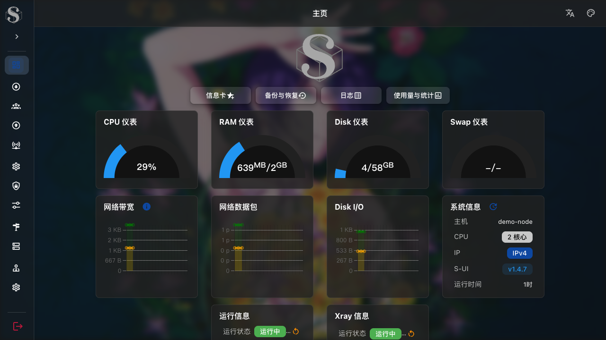
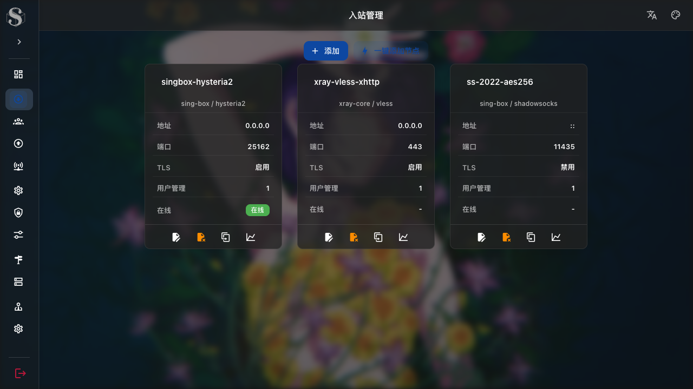
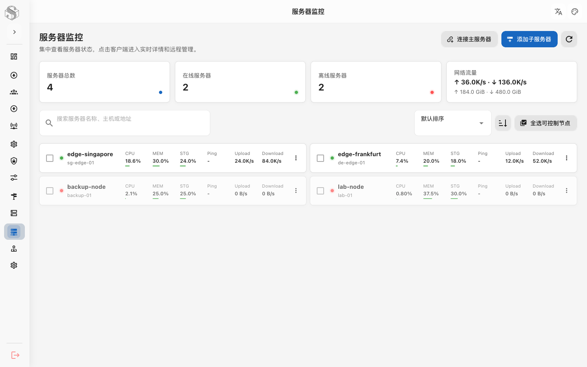
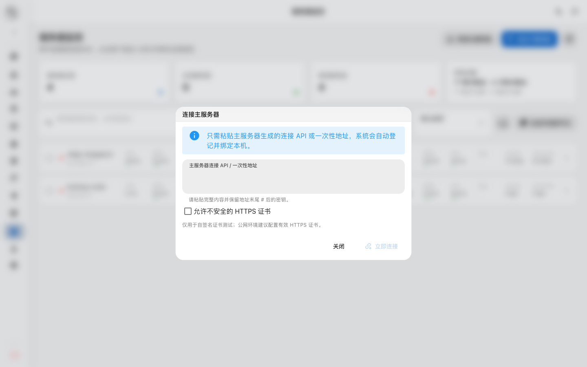
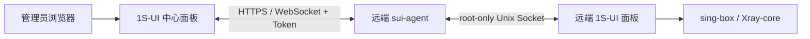

<div align="center">
  
  <h1>1S-UI</h1>
  <p><strong>Linux-first sing-box / Xray-core proxy panel with multi-server monitoring and remote management.</strong></p>
  <p>面向 Ubuntu / Debian 的现代代理管理面板：双内核、批量节点、IPv6 中转、TLS 自动化、服务器监控与远程控制。</p>

  [](https://github.com/Hhz0823/1s-ui/releases/latest)
  [](https://github.com/Hhz0823/1s-ui/actions/workflows/security.yml)
  [](https://github.com/Hhz0823/1s-ui/actions/workflows/docker.yml)
  [](LICENSE)
  [](backend/go.mod)
  [](frontend/package.json)

  **[Linux v1.6.0](https://github.com/Hhz0823/1s-ui/releases/tag/v1.6.0)** · **[OpenWrt Lite v1.5.7](https://github.com/Hhz0823/1s-ui/releases/tag/v1.5.7)** · **[Issues](https://github.com/Hhz0823/1s-ui/issues)**
</div>

> 1S-UI 基于 [alireza0/s-ui](https://github.com/alireza0/s-ui) 二次开发，仅用于学习、研究与技术交流。请遵守当地法律法规。
> 1S-UI is a fork of [S-UI](https://github.com/alireza0/s-ui), provided for learning and research. Comply with local laws.

**语言 Languages:** [简体中文](#简体中文) · [English](#english) · [日本語](#日本語) · [한국어](#한국어) · [Tiếng Việt](#tiếng-việt) · [فارسی](#فارسی)

**导航:** [页面截图](#页面截图) · [快速安装](#快速安装) · [功能矩阵](#功能矩阵) · [服务器监控](#服务器监控) · [一键中转](#一键中转) · [Docker](#docker) · [安全](#安全与权限)

---

## 页面截图

截图来自默认实色主题，不包含账号密码、Token、证书私钥或节点密钥。

| 首页 Dashboard | 入站管理 Inbounds |
| --- | --- |
|  |  |

| 服务器监控 Server Agents | 连接主服务器 Connect Controller |
| --- | --- |
|  |  |

| 实时指标 Live Metrics | 远程入站 Remote Inbounds |
| --- | --- |
|  |  |

---

## 快速安装

### 直接安装

安装脚本不再要求选择类型。默认安装独立前端产物、Go API 后端、sing-box 和 Agent 文件；nginx 托管静态前端并把 API/WS 反代到 `127.0.0.1:2097`，Agent 未绑定主服务器时保持禁用，不占用后台进程。历史订阅服务继续使用 `2096`，与内部 API 端口隔离。
首次打开面板会进入一次性初始化页面，由你在浏览器中创建管理员账号和密码；SSH 安装过程不再询问凭据，也不存在默认 Web 密码。

安装后默认运行在 **客户端模式**：Web 面板、sing-box 和本机节点功能完整可用，但 Agent 注册、心跳与远程控制入口保持关闭。需要集中管理其它服务器时，可在 **设置 → 服务端面板 → 运行角色** 选择 **完整主控制端** 或 **仅监控**；两种服务端角色都会再次校验 2 核 CPU 与 2 GiB 内存。仅监控模式只开放 Agent 注册、心跳、指标和端口流量，后端会拒绝终端、命令、远程入站和中转操作。旧版已经管理 Agent 的面板会自动继承完整主控制端状态，不会因升级断开。

| 用法 | 命令参数 | 结果 |
| --- | --- | --- |
| **默认安装** | 无 | Web UI + sing-box + 休眠 Agent，目标 1 核 512MB |
| **安装并绑定** | `--connect '主服务器公网面板地址'` | 安装后立即接入已打开连接窗口的主服务器 |
| **只监控 Agent** | `install-agent.sh` | 独立 Agent，无 Web UI |
| **兼容旧命令** | `--minimal` / `--managed-client` / `--full` | 旧自动化脚本继续可用；`--full` 仍要求至少 2 核 2GB |

```bash
# 推荐：直接安装，无模式选择
bash <(curl -Ls https://raw.githubusercontent.com/Hhz0823/1s-ui/main/install.sh)

# 指定版本
bash <(curl -Ls https://raw.githubusercontent.com/Hhz0823/1s-ui/main/install.sh) v1.6.0

# 低配主机仍可保留历史双内核：两者可安装，但同一时刻只运行一个
bash <(curl -Ls https://raw.githubusercontent.com/Hhz0823/1s-ui/main/install.sh) v1.6.0 --with-xray

# 全面服务端 + Caddy HTTPS
bash <(curl -Ls https://raw.githubusercontent.com/Hhz0823/1s-ui/main/install.sh) v1.6.0 -y --full --domain panel.example.com --email admin@example.com
```

### 30 秒接入子服务器

1. 在主面板点击 **服务器监控 → 添加子服务器**，系统自动打开 5 分钟的一次性连接窗口。
2. 在子服务器打开 **服务器监控 → 连接主服务器**，只粘贴主服务器公网面板地址，例如 `https://panel.example.com/app/`，点击 **立即连接**。

系统会按子服务器主机名自动登记，并为每台机器签发独立 Agent Token。无需手动填写 WebSocket 地址、节点名称或 Token：

- 子服务器已经安装 1S-UI：打开 **服务器监控 → 连接主服务器**，粘贴主服务器公网面板地址即可；页面会自动补全 Agent enrollment API，无需填写 WebSocket 地址、Token、连接密钥或节点名称。
- 全新服务器：执行同一弹窗生成的“客户端安装并绑定命令”，安装完成后自动绑定。
- 每次连接窗口只允许一台子服务器接入，首次成功后立即关闭；继续添加时再次点击 **添加子服务器**。
- 子服务器会显示当前绑定的主面板地址，可在 Web 页面安全解绑或重新绑定；本机入站和 Web 配置不会被删除。
- HTTP/IP 面板也可使用复制按钮；浏览器不提供安全剪贴板 API 时会自动使用兼容复制方式。

全新服务器安装完整 Web 面板并立即绑定：

```bash
bash <(curl -Ls https://raw.githubusercontent.com/Hhz0823/1s-ui/main/install.sh) v1.6.0 \
  --connect 'https://panel.example.com/app/'
```

只采集监控指标、不安装子服务器 Web 面板：

```bash
bash <(curl -fsSL https://raw.githubusercontent.com/Hhz0823/1s-ui/main/install-agent.sh) \
  --connect 'https://panel.example.com/app/'
```

> 执行前必须先在主面板点击 **添加子服务器**。连接窗口有效 5 分钟且只能成功使用一次，不会永久开放匿名 Agent 注册。

### 安装后的访问地址

| 安装结果 | 面板地址 |
| --- | --- |
| 默认客户端，未启用反代 | `http://服务器IP:2095/app/` |
| 全面服务端，未填写域名 | `http://服务器IP/app/` |
| 全面服务端，Caddy + 域名 | `https://你的域名/app/` |

全面服务端启用公网反向代理后，nginx 前端网关默认只监听 `127.0.0.1:2095`。公网应访问 80/443 的 `/app/`，公网 `IP:2095` 不可访问属于预期安全行为；Go 后端始终使用独立内部监听。

| 配置 | 默认值 |
| --- | --- |
| 管理账号 | 首次访问时在 Web 页面创建，无默认密码 |
| 面板 | `2095` · `/app/` |
| 订阅 | `2096` · `/sub/` |
| 数据目录 | `/usr/local/s-ui/db` |

首次安装完成后请立即打开面板完成管理员初始化；在初始化完成前，不要将面板端口长期暴露给不受信任的网络。

```bash
s-ui
s-ui status
s-ui log
s-ui update
```

### 面板内检测与更新

打开 **设置 → 服务端面板** 即可检查 GitHub 最新稳定版。Linux、root、systemd
且从 `/usr/local/s-ui` 安装的面板会显示 **更新到最新版本** 按钮。更新器只下载当前架构
的固定 Release 压缩包，校验新的 `sui -v` 后原子替换面板文件，并由 systemd 重启；数据库、
入站、证书、Xray 二进制和运行配置不会被删除。在线更新不可用时，仍可使用上面的 `s-ui update`
或安装脚本升级。

---

## 简体中文

### 项目定位

1S-UI 以 **sing-box 为默认内核**，并允许每条入站独立选择 **Xray-core**。当前开发优先级是 Linux（Ubuntu / Debian）；Windows 暂停维护，OpenWrt Lite 暂停在 v1.5.7 且仅使用 sing-box。

低配策略以“系统不因安装或启动面板发生 OOM/重启”为第一优先级：

- 1 核会启用低开销运行参数，但不会单独阻止 sing-box。
- 内存低于 1.5GB 时，安装器默认启动 Web 面板和 sing-box，并使用较低启动预算；仅显式传入 `--skip-core` 才进入纯面板模式。
- 低配档位默认不下载、不自动启动 Xray-core，并设置 `SUI_DISABLE_XRAY=true`；之后可在 **设置 → 服务端面板 → Xray-core 内核** 主动安装，也可在安装命令中加入 `--with-xray`。
- 物理内存或 cgroup 内存上限低于 1.5GiB 时启用“单内核运行”：启动 Xray 前先停止 sing-box，停止、禁用 Xray 或删除最后一个 Xray 入站后自动恢复 sing-box；切换失败也会回滚到原内核。
- 设置页支持安装/更新、启用/禁用、启动/停止和卸载。禁用会保留二进制与入站；存在 Xray 入站时禁止卸载，避免节点配置被静默破坏。面板升级会保留管理员选择的启用状态。
- 作为主服务器创建、管理 Agent 的控制面需要至少 2 核 2GB；受管客户端本身可按低配模式安装。`--force` 不会绕过主控制面的限制。
- 512MB 目标包含轻量 Web 管理和 sing-box 基础代理；代理吞吐仍取决于协议、连接数和线路。

### 功能矩阵

| 模块 | 能力 |
| --- | --- |
| 面板 | 入站、出站、端点、服务、DNS、路由、用户、管理员、订阅、日志、备份与流量统计 |
| 双内核 | 入站级 `sing-box` / `xray` 选择，独立配置生成和运行状态 |
| 端口流量 | 按监听端口显示实时上下行、累计流量、活动状态和配置限速；本机与受管服务器共用同一视图 |
| 入站限速 | sing-box 单入站聚合上传/下载限速，单位 Mbps，`0` 为不限速；TCP/UDP 共用同一端口限额 |
| 快速创建 | 一次创建 1–100 条节点，连续端口、标签、用户、TLS 和安全默认值 |
| TLS | ACME、ECH、Reality、Pinned Certificate SHA256、证书生成与集中管理 |
| 分享与订阅 | Clash、JSON、标准 URI；v2rayN 7.23.4 实机验证 |
| 一键中转 | IPv6 出口池或上游 SOCKS5，自动创建入站、出站、用户和路由 |
| 服务器监控 | 多服务器列表、CPU/内存/磁盘/负载/进程/流量、RTT、P95、丢包和历史曲线 |
| 远程管理 | 修改服务器名称、远程入站 CRUD、1–100 快速节点、IPv6 中转、批量指令和 PTY 终端 |
| 界面 | 默认实色；可选玻璃/清透、自定义背景、模糊、菜单布局和紧凑密度 |
| 反向代理 | 在服务端面板查看和管理 Caddy / Nginx 状态、域名与配置应用 |

#### sing-box 入站

`Mixed`、`SOCKS`、`HTTP`、`Shadowsocks`、`VMess`、`Trojan`、`VLESS`、`Hysteria2`、`ShadowTLS`、`TUIC`、`Naive`、`AnyTLS`、`Direct`。

Shadowsocks 快速创建默认使用 `2022-blake3-aes-256-gcm`。

#### Xray-core 入站与传输

| 类型 | 已支持 |
| --- | --- |
| 入站 | VLESS、VMess、Trojan、Shadowsocks、SOCKS、HTTP、Mixed、Hysteria2、Dokodemo-door、WireGuard |
| 传输 | XHTTP、RAW/TCP、mKCP、gRPC、WebSocket、HTTPUpgrade、Hysteria2 transport |
| TLS / 伪装 | TLS、Reality、XHTTP、Hysteria2 masquerade |
| 自检 | 二进制版本、配置校验、运行状态、协议和传输能力矩阵 |

Xray 上游已移除旧 HTTP/2 和 QUIC transport，请使用 XHTTP `stream-one` / H3。Xray Hysteria2 建议使用 Xray-core `26.7.11` 或更新版本。

### 服务器监控


```mermaid
flowchart LR
    A["管理员浏览器"] --> B["1S-UI 中心面板"]
    B <-->|"HTTPS / WebSocket + Token"| C["远端 sui-agent"]
    C <-->|"root-only Unix Socket"| D["远端 1S-UI 面板"]
    D --> E["sing-box / Xray-core"]
```

Agent 主动出站连接中心面板，远端无需开放 Agent 控制端口：

- 主面板由已登录管理员打开 5 分钟、一次性的地址连接窗口；子服务器只需粘贴公网面板地址，主机名、节点登记和独立 Agent Token 均自动完成。
- 连接窗口只接受首次成功请求并立即关闭，面板重启或切换回客户端角色也会撤销窗口，不会永久开放匿名 Agent 注册。
- 历史 `地址#连接密钥` 仍可使用，保证旧版自动化升级兼容；新版界面不再显示或要求连接密钥。
- WebSocket 长连接负责实时指标、命令、交互终端和控制面 RTT。
- 运行角色可选 `client`、`full`、`monitor`；`monitor` 只保留服务器列表、详情、历史指标和端口流量，控制权限在后端统一拦截。
- WS 暂时断开时回退到 HTTP `/agent/v1/heartbeat`，之后自动重连。
- CPU 使用整个心跳周期的累计时间差计算，避免空闲 VPS 被 200ms 瞬时采样长期显示为 0。
- 一个 Agent 代表一台服务器，一台受管服务器可以包含多条入站。
- 远程入站变更由客户端本地面板校验并应用，不直接修改远端 SQLite。
- 绑定成功后主面板为每台子服务器签发独立 Agent Token；Token 仅保存在子服务器权限 `0600` 的 `/etc/default/1s-ui-agent`。
- 远程 Shell 和 PTY 权限等同 Agent 的系统用户，通常是 root，请严格保护面板账号。

### 一键中转

| 项目 | 支持 |
| --- | --- |
| 来源 | 本机公网 IPv6 池、上游 SOCKS5 |
| 协议 | SOCKS5、HTTP、Mixed、Shadowsocks、VLESS、VMess、Trojan、Hysteria2、TUIC、Naive、AnyTLS |
| 批量 | 每批 1–100 条；已用端口自动跳过并继续分配 |
| 导出 | BitBrowser Excel、纯文本 `IP:端口:账号:密码` |
| IPv6 连接方式 | 客户端连接原 VPS IPv4/域名，每条代理仅绑定对应 IPv6 出口 |

IPv6 池模式只会向选定网卡添加地址，不修改系统默认路由。每个地址都经过 DAD 和公网出口验证，失败会回滚。VPS 必须拥有服务商已路由或授权的 IPv6 前缀；仅添加随机 `/64` 地址无法绕过源地址过滤。

实现参考 [help660vip/auto-add-ipv6](https://github.com/help660vip/auto-add-ipv6) 的流程，但 1S-UI 使用内置 Go 逻辑，不执行第三方远程脚本。

### v1.6.0 更新重点

- 重构客户端/主控制端运行角色：新安装默认关闭 Agent 公共入口，主控制端必须在设置中显式开启；旧控制面自动兼容。
- 低配置服务器可在设置页按需安装或更新官方 Xray-core；下载、校验、原子安装后保持 sing-box 默认和 Xray 按需启动。
- 增加 Xray 完整生命周期管理与入站保护；低于 1.5GiB 的主机采用 sing-box/Xray 互斥运行，并在停止或切换失败时自动恢复可用内核。
- 子服务器增加当前主面板绑定状态、重新绑定确认和安全解绑，不再需要编辑 Agent 环境文件。
- 修复低配置安装误进入纯面板模式的问题：轻量版和受管客户端默认启动 sing-box，Xray-core 仍保持禁用。
- 修复自动生成的 HY2 TLS 证书指纹可能与实际证书不一致的问题；启动时会同步修复 TLS、出站配置和已保存的分享链接。
- 修复批量节点与远程快速创建使用 IPv6 监听地址后，客户端无法通过原 VPS 公网 IPv4 连接的问题。
- 主服务器新增 5 分钟单次地址连接窗口：子服务器只粘贴公网面板地址即可自动登记、获取独立 Token 并建立 WebSocket。
- 地址窗口首次连接成功后立即关闭，同时保留旧版带密钥地址兼容，并区分“完整 Web 面板受管客户端”和“仅监控 Agent”安装方式。
- 修复 HTTP/IP 面板中复制按钮失败的问题，在非安全上下文自动回退到兼容剪贴板方案。
- 全新的服务器监控列表和节点详情页，提供实时指标、历史曲线、网络流量和远程控制标签页。
- 修复低负载 Linux VPS 的 CPU 长期显示 `0.0%`，小于 1% 时显示两位小数。
- 修复节点详情页在桌面和移动端无法继续下滑的问题。
- 受管客户端支持远程入站 CRUD、1–100 快速创建和 IPv6 / 上游 SOCKS5 中转。
- 修复 HY2、TUIC、AnyTLS、VLESS、Trojan、VMess、Naive 分享链接在 v2rayN 的转义、TLS 钉扎和传输兼容。
- 增加服务端反向代理管理、Xray 自检与 WireGuard / Hysteria2 / Dokodemo-door 配置生成。
- 恢复低配主机的可选双内核安装：sing-box 默认运行，显式 `--with-xray` 才下载 Xray，且低配仅按需启动。
- 设置页增加 GitHub 最新稳定版检测与受保护的 Linux 在线更新流程，更新前校验架构 Release 包和新面板二进制。
- Linux Release 提供 `amd64`、`arm64`、`armv5`、`armv6`、`armv7`、`386`、`s390x` 七种架构包。
- 前后端物理拆分为 `backend/` Go 模块与 `frontend/` Vue + TypeScript SPA；Node 只参与构建，VPS 运行时不需要 Node.js。
- 玻璃界面升级为统一液态材质：按钮以低透明层和 `backdrop-filter` 直接采样后方背景，并提供跟随鼠标的局部折射、悬停与按压反馈；下拉菜单、侧栏、标签、展开面板和二级弹窗共享景深动画。
- 前端 Logo 更新为透明 SVG 的可爱玻璃 S 角色，在侧栏、登录、初始化和首页不同尺寸下保持清晰。
- 增加本机与受管服务器端口流量页，3 秒采样实时上下行并结合 SQLite 时间桶显示累计流量；100 条入站在移动端和桌面端只渲染一套列表。
- 增加 sing-box 单入站上传/下载限速，限额由共享连接追踪层同时作用于 TCP/UDP；Xray 入站会明确拒绝非零限速，避免系统级规则误伤 SSH 或面板端口。
- 服务端角色扩展为完整主控制端与仅监控；仅监控模式保留在线指标和端口流量，并在 Service 层拒绝远程控制。

---

## English

1S-UI is a Linux-focused proxy panel with sing-box as the default core and optional Xray-core selection per inbound.

### Highlights

- Complete Web UI for inbounds, outbounds, endpoints, routing, DNS, users, subscriptions, TLS, logs, backup, and traffic.
- 1–100 node quick creation with safe protocol defaults and automatic used-port skipping.
- sing-box plus Xray protocols including XHTTP, RAW, gRPC, WebSocket, Hysteria2, Dokodemo-door, and WireGuard.
- IPv6 egress pools and upstream SOCKS5 relays with BitBrowser Excel/plain-text export.
- Outbound Agent connections over WebSocket/HTTP; no inbound Agent control port is required.
- An authenticated controller admin opens a five-minute, single-use connection window; the child pastes only the public panel address.
- Each child is registered by hostname and receives its own Agent token. The window closes after the first successful connection.
- Clipboard actions also work on HTTP/IP panels through a compatibility fallback when the secure Clipboard API is unavailable.
- Live CPU, memory, disk, process, network, RTT/P95/loss metrics, history charts, remote commands, and PTY terminal.
- Managed-server inbound CRUD, remote quick-add, and remote relay creation through a root-only Unix socket.
- Default solid UI, responsive desktop/mobile layouts, optional backgrounds and glass/clear styles.

### Resource profiles

| Profile | Minimum target | Notes |
| --- | --- | --- |
| Unified client | 1 vCPU / 512MB | Full Web UI + sing-box + dormant Agent; Xray is not downloaded by default |
| Full control plane | 2 vCPU / 2GB | Hard requirement; includes Xray, Agent, and reverse proxy |

The 2 vCPU / 2GB hard requirement applies to a panel acting as the Agent control plane. Managed child panels can use the low-resource profile and start sing-box by default; only an explicit `--skip-core` leaves proxy cores stopped. A low-resource host may install both cores, but below 1.5GiB only one runs at a time: starting Xray stops sing-box, and stopping or disabling Xray restores sing-box automatically.

Quick install:

```bash
bash <(curl -Ls https://raw.githubusercontent.com/Hhz0823/1s-ui/main/install.sh)
```

To attach a child server, click **Server Monitoring → Add Child Server** on the controller, then paste only its public panel address into **Server Monitoring → Connect to Controller** on the child. For a fresh child with a full Web panel:

```bash
bash <(curl -Ls https://raw.githubusercontent.com/Hhz0823/1s-ui/main/install.sh) v1.6.0 \
  --connect 'https://panel.example.com/app/'
```

The first browser visit creates the administrator; there is no default Web password. Panel `2095` `/app/`, subscription `2096` `/sub/`, database `/usr/local/s-ui/db`.

With the full reverse-proxy profile, use `http://server-ip/app/` or `https://your-domain/app/`. Port `2095` is intentionally bound to localhost.

---

## 日本語

1S-UI は Ubuntu / Debian 向けのプロキシ管理パネルです。標準コアは sing-box、入站ごとに Xray-core を選択できます。v1.6.0 は 1–100 件の一括ノード作成、IPv6 出口中継、サーバー Agent 監視、履歴グラフ、遠隔操作、PTY ターミナル、Caddy / Nginx 管理に対応します。メインパネルで接続ウィンドウを開いた後、子サーバーは公開パネルアドレスだけで登録できます。

```bash
bash <(curl -Ls https://raw.githubusercontent.com/Hhz0823/1s-ui/main/install.sh) v1.6.0
```

Linux が主なサポート対象です。Windows は保守停止中、OpenWrt Lite は sing-box 専用 v1.5.7 を継続します。

## 한국어

1S-UI는 Ubuntu/Debian 중심의 프록시 관리 패널입니다. 기본 코어는 sing-box이며 인바운드별로 Xray-core를 선택할 수 있습니다. v1.6.0은 1–100개 노드 일괄 생성, IPv6 출구 릴레이, 서버 Agent 모니터링, 기록 차트, 원격 제어, PTY 터미널 및 Caddy/Nginx 관리를 지원합니다. 메인 패널에서 연결 창을 연 뒤 자식 서버에는 공개 패널 주소만 입력하면 됩니다.

```bash
bash <(curl -Ls https://raw.githubusercontent.com/Hhz0823/1s-ui/main/install.sh) v1.6.0
```

## Tiếng Việt

1S-UI là bảng điều khiển proxy ưu tiên Ubuntu/Debian, dùng sing-box mặc định và cho phép chọn Xray-core theo từng inbound. Phiên bản v1.6.0 hỗ trợ tạo hàng loạt 1–100 node, relay IPv6, giám sát Agent, biểu đồ lịch sử, điều khiển từ xa và terminal PTY. Sau khi mở cửa sổ kết nối trên bảng điều khiển chính, máy con chỉ cần dán địa chỉ công khai của bảng điều khiển.

```bash
bash <(curl -Ls https://raw.githubusercontent.com/Hhz0823/1s-ui/main/install.sh) v1.6.0
```

## فارسی

1S-UI یک پنل مدیریت پروکسی برای Ubuntu و Debian است. هسته پیش‌فرض sing-box است و برای هر inbound می‌توان Xray-core را انتخاب کرد. نسخه v1.6.0 ساخت گروهی ۱ تا ۱۰۰ نود، خروجی IPv6، پایش Agent، نمودارهای زنده، کنترل از راه دور و ترمینال PTY را پشتیبانی می‌کند. پس از بازکردن پنجره اتصال در پنل اصلی، سرور فرزند فقط نشانی عمومی پنل را وارد می‌کند.

```bash
bash <(curl -Ls https://raw.githubusercontent.com/Hhz0823/1s-ui/main/install.sh) v1.6.0
```

---

## Docker

Docker 镜像现在是 API-only 后端，默认监听 `0.0.0.0:2097`；生产 Web UI 请使用 Release 中独立的 `s-ui-frontend.tar.gz` 与 nginx 网关。

```bash
docker run -d \
  --network host \
  -v "$PWD/db:/app/db" \
  -v "$PWD/cert:/app/cert" \
  --name s-ui \
  --restart unless-stopped \
  ghcr.io/Hhz0823/1s-ui
```

Docker Compose:

```yaml
services:
  s-ui:
    image: ghcr.io/Hhz0823/1s-ui
    container_name: s-ui
    network_mode: host
    volumes:
      - ./db:/app/db
      - ./cert:/app/cert
    restart: unless-stopped
    entrypoint: ./entrypoint.sh
```

## OpenWrt Lite

OpenWrt Lite 暂停在 v1.5.7，仅包含 sing-box。当前开发优先更新 Linux，不更新 OpenWrt 插件。

```bash
opkg install ./s-ui-lite_1.5.7-1_x86_64.ipk
/etc/init.d/s-ui-lite enable
/etc/init.d/s-ui-lite start
```

详见 [docs/openwrt-lite.md](docs/openwrt-lite.md)。

## 源码构建

开发构建需要 Go、Node.js/npm 和 C 编译器：

```bash
cd frontend
npm ci
npm run build
cd ..
tar -C frontend/dist -czf s-ui-frontend.tar.gz .
cd backend
go build -o ../sui .
go build -o ../sui-agent ./cmd/sui-agent
```

验证：

```bash
(cd backend && go test ./...)
(cd backend && go test -tags openwrt_lite ./...)
(cd backend && go vet ./...)
(cd frontend && npm run build)
```

正式 Release 使用 GitHub Actions 构建带 CGO、musl 和 Naive 支持的 Linux 多架构包；普通本地 `go build` 不等同于正式 Release 构建。

## 目录结构

```text
backend/      独立 Go 模块（main.go、go.mod 与全部 Go 包）
docs/         文档与页面截图
frontend/     独立 Vue 3 + Vuetify 静态应用
packaging/    OpenWrt Lite 等平台安装文件
scripts/      构建与安装安全测试
windows/      Windows 脚本（暂停维护）
```

## 环境变量

| 变量 | 默认 | 说明 |
| --- | --- | --- |
| `SUI_LOG_LEVEL` | `info` | 日志级别 |
| `SUI_DEBUG` | `false` | 调试模式 |
| `SUI_DB_FOLDER` | 程序目录下 `db` | 数据库目录 |
| `SUI_BIN_FOLDER` | 程序目录下 `bin` | 运行时二进制目录 |
| `SUI_API_LISTEN` | `127.0.0.1` | API-only 后端监听地址；systemd 显式设置 |
| `SUI_API_PORT` | `2097` | API-only 后端监听端口；与默认订阅端口 `2096` 隔离，不覆盖数据库中的前端入口端口 |
| `SUI_ALLOWED_ORIGINS` | 空 | 允许携带 Cookie 的精确跨域 Origin，逗号分隔；空值仅同源 |
| `SUI_SESSION_SAME_SITE` | `lax` | 可显式设为 `none`，此时 Cookie 强制 `Secure` |
| `SUI_XRAY_PATH` | `$SUI_BIN_FOLDER/xray` | Xray 二进制路径 |
| `SUI_XRAY_CONFIG` | `$SUI_BIN_FOLDER/xray.json` | Xray 配置路径 |
| `SUI_DISABLE_XRAY` | `false` | 禁止启动 Xray 和创建 Xray 入站；低配默认设置 |
| `SUI_XRAY_ON_DEMAND` | `false` | 保留 Xray 但禁止自动启动；低配显式 `--with-xray` 时设置 |

数据库中的 `webListen/webPort/webPath/webDomain` 继续表示用户访问的前端入口。固定 API 路径为 `/api`、`/apiv2`、`/agent/v1`，并保留 `webPath` 下的旧别名。nginx 从 `/.well-known/1s-ui/config.js` 提供无缓存运行时配置；后端不托管 HTML、assets 或 SPA。

## 安全与权限

1. 首次访问时创建独立的强管理员密码；面板不提供默认 Web 密码。
2. 公网控制面使用 HTTPS，并限制面板访问来源。
3. 妥善保护数据库、证书、私钥、管理员 Token 和 Agent Token。
4. 地址连接窗口只在添加子服务器时临时开启；不要长时间重复开启，并妥善保护每台机器签发的 Agent Token。
5. 远程 Shell / PTY 权限等同 Agent 系统用户，通常是 root。
6. 定期备份 `/usr/local/s-ui/db`，升级前保留可回滚副本。
7. 不要为 IPv6 中转修改系统默认路由；使用面板内置的源地址绑定和验证流程。

## Credits

- [SagerNet/sing-box](https://github.com/SagerNet/sing-box)
- [XTLS/Xray-core](https://github.com/XTLS/Xray-core)
- [alireza0/s-ui](https://github.com/alireza0/s-ui)
- 所有参与测试与反馈的用户

## License

[GPL-3.0](LICENSE)
