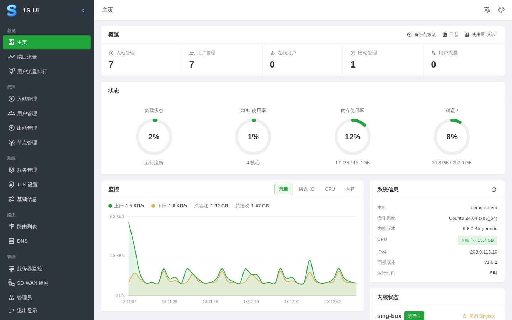
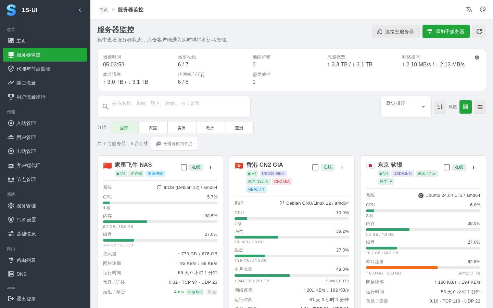
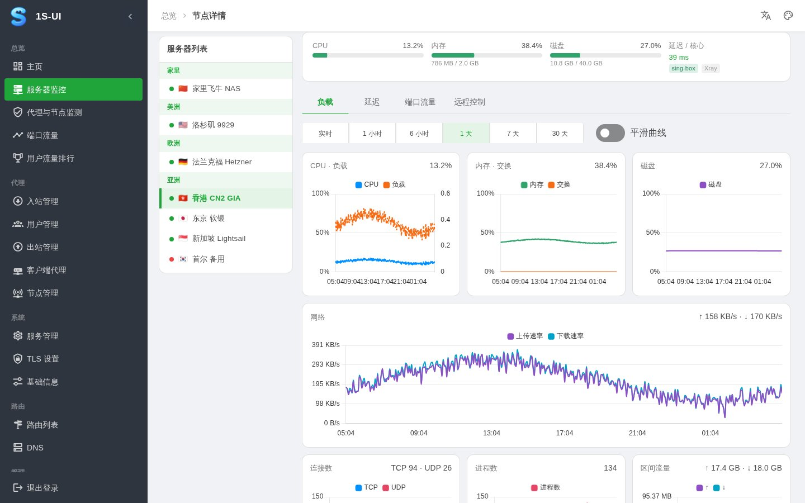
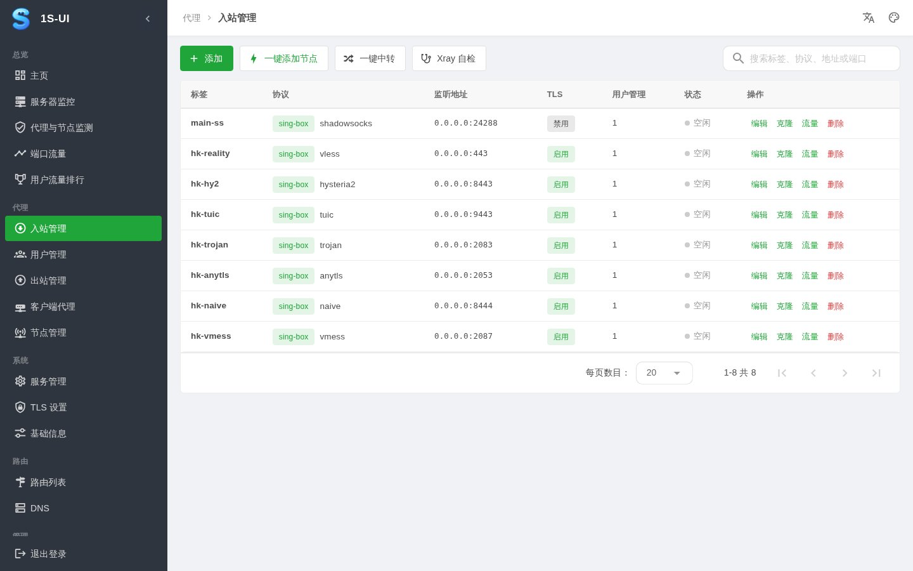
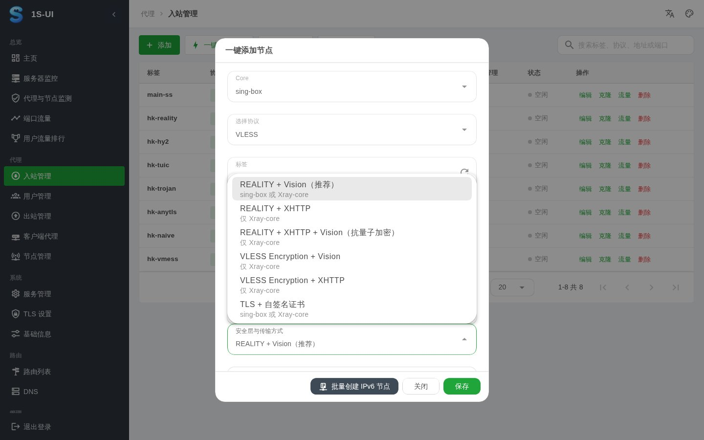
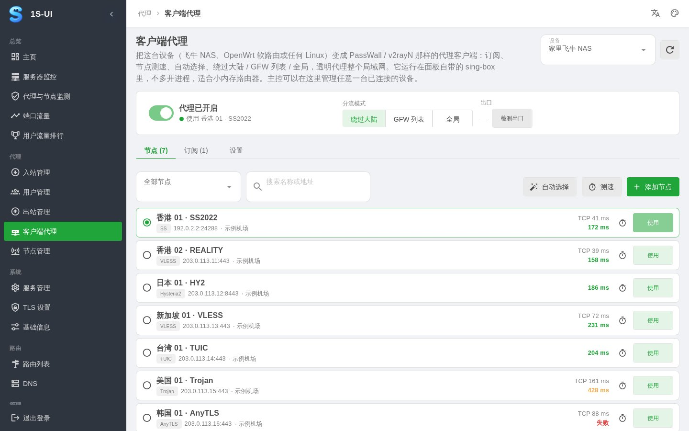
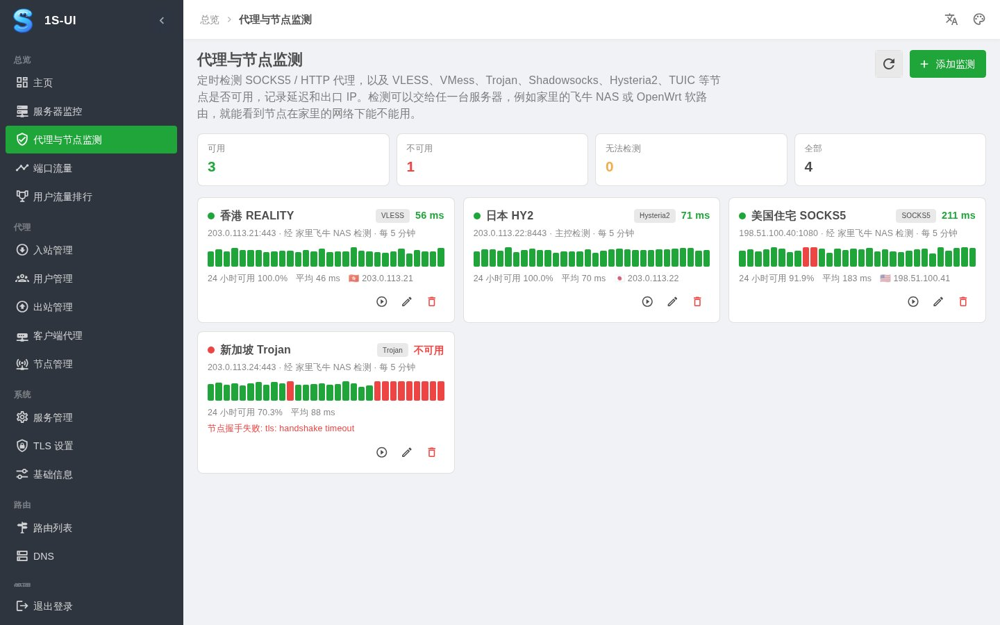
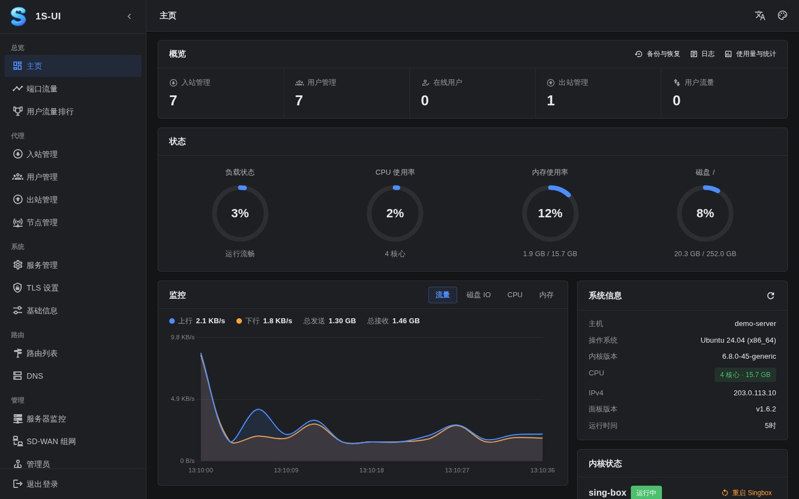

<div align="center">
  
  <h1>1S-UI</h1>
  <p><strong>sing-box / Xray-core 多服务器群控面板，也是飞牛 NAS 和 OpenWrt 上的代理客户端</strong></p>
  <p>A multi-server control panel for sing-box / Xray-core, and a proxy client for home NAS boxes and OpenWrt routers.</p>

  [](https://github.com/Hhz0823/1s-ui/releases/latest)
  [](https://github.com/Hhz0823/1s-ui/actions/workflows/security.yml)
  [](LICENSE)
  [](backend/go.mod)
  [](frontend/package.json)

  **[下载 v1.7.1](https://github.com/Hhz0823/1s-ui/releases/tag/v1.7.1)** · **[安装](#安装)** · **[更新日志](CHANGELOG.md)** · **[安卓 App](#安卓-app)** · **[OpenWrt](docs/openwrt-lite.md)** · **[English](#english)**
</div>

> 1S-UI 基于 [alireza0/s-ui](https://github.com/alireza0/s-ui) 二次开发，仅用于学习、研究与技术交流。请遵守当地法律法规。
> 1S-UI is a fork of [S-UI](https://github.com/alireza0/s-ui), provided for learning and research. Comply with local laws.

**语言 Languages:** [简体中文](#简介) · [English](#english) · [日本語](#日本語) · [한국어](#한국어) · [Tiếng Việt](#tiếng-việt) · [فارسی](#فارسی)

**导航:** [截图](#截图) · [功能](#功能) · [安装](#安装) · [纳管服务器和设备](#纳管服务器和设备) · [使用说明](#使用说明) · [安卓 App](#安卓-app) · [OpenWrt](#openwrt-软路由) · [安全](#安全建议)

---

## 简介

1S-UI 是一个代理服务器管理面板，默认内核是 sing-box，每个入站也可以单独选用 Xray-core。同一个安装包有三种用法：

- **单机面板**：管理一台服务器上的入站、用户、出站、路由、DNS、证书和订阅；一键创建 REALITY、Hysteria2、TUIC、AnyTLS、Naive 等节点，分享链接按 v2rayN、v2rayNG、小火箭、PassWall 的解析规则生成。
- **多服务器群控**：任选一台当主控，集中查看所有服务器的实时和历史状态，远程管理入站、批量创建节点、配置 IPv6 / SOCKS5 中转和 SD-WAN 组网，执行批量命令和网页终端。子服务器主动连接主控，不用开放额外端口；主控离线时，子服务器上的节点照常工作。
- **家用代理客户端**：装在飞牛 NAS、家里的 Linux 或 OpenWrt 软路由上，像 PassWall / v2rayN 一样订阅、测速、分流，透明代理整个局域网，由主控和手机远程切换节点。这些设备同时是家里的检测点：可以从家里的网络监测节点能不能用、测到 VPS 的线路。

配套的[安卓 App](#安卓-app) 用监控密钥绑定一个或多个面板：集中查看所有服务器、测速、管理家里设备的代理，服务器离线或节点不可用时通知。

## 截图

截图中的服务器、地址和流量都是演示数据（文档专用的示例 IP），不含真实账号、密钥或节点。默认是宝塔绿主题，右上角可换 1Panel 等 28 个主题，「设置 → 界面」还可以改用玻璃、实色或清透风格。

| 首页 Home | 服务器监控 Server Monitor |
| --- | --- |
|  |  |

| 服务器详情 Server Detail | 入站管理 Inbounds |
| --- | --- |
|  |  |

| 一键添加节点 Quick Add | 客户端代理 Proxy Client |
| --- | --- |
|  |  |

| 代理与节点监测 Proxy & Node Monitors | 1Panel 暗色主题 1Panel Dark |
| --- | --- |
|  |  |

## 功能

| 模块 | 能力 |
| --- | --- |
| 服务器监控 | Komari 风格的网格 / 表格视图，分组、地区、标签、价格、到期和月流量；在线状态、CPU、内存、磁盘、负载、进程、网速、TCP / UDP 连接数、延迟、P95 和丢包，实时到 30 天的历史曲线 |
| 远程管理 | 远程增删改查和启停入站、一次创建 1–100 条节点、IPv6 / 上游 SOCKS5 中转、批量命令、网页终端；主控一键登录子服务器自己的面板 |
| 代理协议 | sing-box：Mixed、SOCKS、HTTP、Shadowsocks、VMess、Trojan、VLESS、Hysteria2、ShadowTLS、TUIC、Naive、AnyTLS、Direct；Xray-core：VLESS、VMess、Trojan、Shadowsocks、SOCKS、HTTP、Mixed、Hysteria2、Dokodemo-door、WireGuard，传输 XHTTP、RAW、mKCP、gRPC、WebSocket、HTTPUpgrade |
| 一键创建 | VLESS 六种模式（默认 REALITY + Vision，另有 XHTTP、抗量子 VLESS Encryption、XHTTP 下载走 CDN）、NaiveProxy、Hysteria2、TUIC、AnyTLS 等；证书、密钥、用户和链接一次生成 |
| TLS 与订阅 | ACME、ECH、REALITY、证书指纹锁定；Clash、JSON 和标准链接三种订阅 |
| 流量 | 端口实时速率与累计流量、用户流量与带宽排行；sing-box 入站可限速，可设每月流量上限、重置日和客户端 IP 数上限 |
| 代理客户端 | 类似 PassWall / v2rayN：订阅（显示已用流量和到期时间，可定时更新）、分享链接、测延迟、手动或自动选最快节点；绕过中国大陆 / 仅 GFW 列表 / 全局；TUN 透明代理局域网、SOCKS5 + HTTP 端口、分流 DNS |
| 代理与节点监测 | 定时检测 SOCKS5 / HTTP 代理和各协议节点能不能用、延迟多少、出口 IP 在哪；可以交给任意一台服务器或家里的设备检测，保留 3 天记录 |
| 测速 | 手机或另一台服务器到服务器的 TCP / UDP 延迟、丢包、抖动和上下行速度 |
| 一键中转 | IPv6 出口池或上游 SOCKS5，自动创建入站、出站、用户和路由，可导出 BitBrowser 表格 |
| SD-WAN | 多台服务器合并为一个入口，按实时延迟走最快的 REALITY（TCP）或 Hysteria2（QUIC）线路，故障约 5 秒内切换，带网络检测和一键调优 |
| 安卓 App | 所有面板的服务器集中显示，节点、测速、监测和家用设备的代理管理，离线与故障通知，检查更新 |
| OpenWrt | 单进程精简版，面板、sing-box 和 Agent 共用一个进程，约 50 MB 内存，11 个架构的安装包随 Release 发布 |
| 界面 | 宝塔 / 1Panel 风格，列表页统一为工具栏 + 表格，路由和 DNS 规则可拖动排序；28 个主题、浅色 / 深色跟随系统、强调色和圆角；简体中文、繁體中文、English、Русский、Tiếng Việt、فارسی |
| 下载线路 | 安装、在线更新和子服务器安装都有中国大陆加速线路，GitHub 连不上或太慢时自动切换 |
| 反向代理 | 在面板里管理 Caddy / Nginx 的状态、域名和配置 |

## 快速开始

### 安装

适用于 Ubuntu / Debian 等使用 systemd 的 Linux，提供 amd64、arm64、armv7、armv6、armv5、386、s390x 七种架构。用 root 执行：

```bash
bash <(curl -Ls https://raw.githubusercontent.com/Hhz0823/1s-ui/main/install.sh)
```

中国大陆服务器（GitHub 慢或连不上）改用加速线路，脚本和安装包都经 ghfast.top 等镜像下载：

```bash
bash <(curl -Ls https://ghfast.top/https://raw.githubusercontent.com/Hhz0823/1s-ui/main/install.sh) --mirror cn
```

- 主控和子服务器用同一条命令。飞牛 NAS 和 OpenWrt 用主控生成的带密钥命令，见[飞牛 NAS 和 OpenWrt](#飞牛-nas-和-openwrt)。
- 默认 `--mirror auto`：GitHub 连不上或太慢时自动换加速线路；`--mirror github` 只用 GitHub，`--mirror https://你的加速地址/` 用自建镜像。安装包按 Release 附带的 SHA256SUMS 校验。
- 在命令末尾加上版本号（例如 `v1.7.1`）可以安装指定版本。
- 安装内容：网页界面（由 nginx 提供）、Go 后端、sing-box 和 Agent。Agent 在绑定主控之前不运行；Xray-core 可以之后在面板里安装。

### 首次设置

安装完成后用浏览器打开面板，首次进入是设置向导：创建管理员账号（面板没有默认密码），选择运行角色；子服务器可以在向导里直接填写主控的面板地址完成绑定。在完成向导之前，不要把面板端口长期暴露在不受信任的网络上。

运行角色之后可以在 **设置 → 前端与后端 → 运行角色** 修改：

| 角色 | 用途 | 配置要求 |
| --- | --- | --- |
| 客户端（默认） | 单机使用，或作为子服务器被主控纳管 | 1 核 512 MB 起 |
| 完整主控制端 | 集中监控和管理其它服务器 | 2 核 2 GiB 起；更低的配置（1 核 512 MB 起）以精简模式运行，群控功能不变，只用 sing-box 内核 |
| 仅监控 | 只看服务器状态和端口流量，后端拒绝终端、命令、远程入站和中转 | 同上 |

### 访问地址

| 安装方式 | 面板地址 |
| --- | --- |
| 默认 | `http://服务器IP:2095/app/` |
| 安装时加 `--with-proxy`，不填域名 | `http://服务器IP/app/` |
| 安装时加 `--domain 你的域名`（Caddy 自动申请 HTTPS 证书） | `https://你的域名/app/` |
| OpenWrt | `http://路由器IP:2095/app/`（打开 `http://路由器IP:2095/` 会自动跳转） |

装了反向代理后，面板只监听 `127.0.0.1:2095`，公网从 80 / 443 的 `/app/` 访问，公网 `IP:2095` 打不开属于正常。订阅地址默认是 `2096` 端口的 `/sub/`，数据在 `/usr/local/s-ui/db`，Go 后端只监听 `127.0.0.1:2097`。

### 常用命令

```bash
s-ui            # 管理菜单
s-ui status     # 运行状态
s-ui log        # 查看日志
s-ui restart    # 重启面板
s-ui update     # 重新安装最新版，数据保留
s-ui uninstall  # 卸载
```

### 更新

- **面板内**：在 **设置 → 前端与后端 → 版本更新** 检查新版本，点 **更新到最新版本**（Linux、systemd、安装在 `/usr/local/s-ui` 时可用）。更新器只下载当前架构的 Release 包，校验新程序后原子替换并重启；数据库、入站、证书和 Xray-core 都会保留，网页界面一起更新。
- **命令行**：重新运行安装命令，数据同样保留。v1.6.3 及更早版本自带的 `s-ui update` 会下载过时的安装脚本，请改用安装命令。
- **下载线路**：在 **设置 → 前端与后端 → 下载线路** 选择，默认自动切换。服务器连不上 api.github.com 时，更新和 Xray-core 安装会改走 github.com 或加速镜像：Xray-core 按官方或面板内置的 SHA256 校验；面板更新包在拿不到 GitHub 的校验值时，只从 GitHub 或你在 **GitHub 加速地址** 里填写的地址下载。

## 纳管服务器和设备

### 纳管 VPS

1. 在主控打开 **服务器监控 → 添加子服务器**，主控会打开一个 5 分钟有效、只能成功使用一次的连接窗口。
2. 新装的子服务器在设置向导最后一步填写主控的面板地址；已经设置过的，在 **服务器监控 → 连接主服务器** 里填写。
3. 连接后主控按主机名登记这台服务器，并为它签发独立的 Agent Token。之后可以在主控里改名，设置分组、地区、标签、价格、到期时间和月流量上限。

- Agent 从子服务器主动连接主控（WebSocket，断开时退回 HTTP 心跳），子服务器不用开放额外端口。Token 只保存在子服务器的 `/etc/default/1s-ui-agent`（权限 `0600`）。
- 远程入站操作由子服务器自己的面板校验和执行，主控不会直接修改子服务器的数据库。
- 子服务器的面板会显示当前绑定的主控，可以解绑或重新绑定，本机入站和设置不受影响。

### 飞牛 NAS 和 OpenWrt

在主控打开 **服务器监控 → 添加子服务器**，展开 **飞牛 NAS / OpenWrt / 面板地址 + 密钥接入**，点 **生成接入密钥**（只显示一次，可以重复用于多台设备），再按设备类型复制命令：

| 设备类型 | 安装内容 | 适合 |
| --- | --- | --- |
| **1S-UI 客户端** | 完整 1S-UI，并绑定主控 | 飞牛 NAS、家里的 Linux：当[代理客户端](#代理客户端)，也当监测和测速的检测点 |
| **OpenWrt 软路由** | 单进程精简版，约 50 MB 内存 | 软路由：透明代理整个局域网，也当检测点，见 [OpenWrt 软路由](#openwrt-软路由) |
| **仅监控 Agent** | 只装 `sui-agent` | 只需要监控和远程命令的服务器 |

飞牛 NAS 先在 **设置 → SSH** 开启 SSH，用管理员账号登录后粘贴面板给出的命令（会提示输入管理员密码），命令形如：

```bash
curl -fsSL https://raw.githubusercontent.com/Hhz0823/1s-ui/main/install.sh -o /tmp/1s-ui.sh \
  && sudo bash /tmp/1s-ui.sh --panel 'https://主控面板地址/app/' --key '接入密钥' '1.7.1'
```

OpenWrt 用 root 登录 SSH 后粘贴：

```sh
wget -O /tmp/1s-ui-openwrt.sh https://raw.githubusercontent.com/Hhz0823/1s-ui/main/install-openwrt.sh \
  && sh /tmp/1s-ui-openwrt.sh --panel 'https://主控面板地址/app/' --key '接入密钥' --version '1.7.1'
```

- 面板给出的命令带上了主控的版本号，装好的设备和主控版本一致。中国大陆的设备使用 **中国大陆** 版命令，经加速镜像下载并按 SHA256SUMS 校验。
- 主控校验密钥通过后，才给这台设备签发它自己的 Agent Token。重新生成或停用密钥只影响之后的接入，已经接入的设备不受影响。
- 在同一台设备上重新运行命令，会用新的绑定替换旧的。其它使用 systemd 的 Linux 设备也可以用 **1S-UI 客户端** 命令。

### 打开子服务器的面板

在主控的服务器详情点 **打开客户端后台**：主控通过 Agent 连接签发一张 60 秒有效、只能用一次的登录票据，在新窗口进入子服务器自己的面板，不需要也不会共享子服务器的管理员密码。浏览器需要能访问子服务器上报的面板地址。

## 使用说明

### 一键创建节点

**入站管理 → 一键添加节点** 一次创建 1–100 条节点，端口、标签、用户、证书、REALITY 密钥和分享链接一次生成；主控在服务器详情点 **管理入站**，可以用同样的方式给子服务器建节点。VLESS 有六种模式，选择只有 Xray-core 支持的模式时会自动改用 Xray-core：

| 模式 | 内核 | v2rayN | v2rayNG | 小火箭（Shadowrocket） | Anywhere | PassWall / PassWall 2 |
| --- | --- | --- | --- | --- | --- | --- |
| REALITY + Vision（默认，推荐） | sing-box / Xray-core | ✅ | ✅ | ✅ | ✅ | ✅ |
| REALITY + XHTTP | Xray-core | ✅ | ✅ | ✅ | ✅ | ✅ |
| REALITY + XHTTP + Vision（含 VLESS Encryption） | Xray-core | ✅ | ✅ | 未确认 | iOS 26+ | ✅ |
| VLESS Encryption + Vision | Xray-core | ✅ | ✅ | 未确认 | iOS 26+ | ✅ 订阅导入；在节点页粘贴链接会丢失 flow，需手动选 `xtls-rprx-vision` |
| VLESS Encryption + XHTTP | Xray-core | ✅ | ✅ | 未确认 | iOS 26+ | ✅ |
| TLS + 自签名证书 | sing-box / Xray-core | ✅ | ✅ | ✅ | 需先在 Trusted Certificates 添加链接中的 `pcs` 指纹 | ✅ |
| NaiveProxy（HTTPS / HTTP/2） | sing-box | ✅（分享链接，已用 v2rayN 所用的 sing-box 实测） | ❌ 客户端未实现 | 手动添加：NaiveProxy 类型，旧版为 HTTPS/HTTP2 并开启 Padding | ❌ 客户端未实现 | 可解析 `naive+https` 链接（未实测） |

- 三种 XHTTP 模式可以打开「下行分离」：上传直连服务器，下载经 Cloudflare 等 CDN 回源，适合回程线路差的服务器；创建前面板会经 CDN 检查域名是否真的到达本机。
- 一键创建的 Naive 节点使用面板私有 CA 和 45 天的服务器证书，自动续期（Chromium 内核的客户端不接受有效期超过 200 天的证书）。
- REALITY 伪装目标、Xray-core 版本要求、PassWall 的注意事项、其它协议的默认值和分享链接格式，见[一键创建节点与客户端兼容性](docs/quick-create.md)。

### 代理客户端

**代理 → 客户端代理** 把这台设备变成像 PassWall / v2rayN 那样的代理客户端，适合飞牛 NAS、OpenWrt 软路由和家里的 Linux：

- 导入订阅（显示已用流量、总流量和到期时间）或粘贴分享链接；测延迟，手动选节点，或从一组节点中自动选最快的。
- 三种分流模式：绕过中国大陆、仅 GFW 列表、全局。
- TUN 透明代理：本机和局域网设备不用设置代理；在 OpenWrt 上接管整个局域网（fw4 无需额外规则），绕过大陆模式下大陆 IP 不进 sing-box。
- SOCKS5 + HTTP 端口（默认 7890，默认只接受局域网连接）；分流 DNS（大陆域名走国内 DNS，其余走 DoH）；可以指定设备或域名走 / 不走代理。
- 运行在面板自己的 sing-box 里，不额外起进程。
- 主控的 **客户端代理** 页面可以选择任意一台绑定的设备，远程开关代理、切换模式和节点、测延迟、更新订阅；安卓 App 的「客户端」页也可以。

### 代理与节点监测

**总览 → 代理与节点监测** 定时检查代理和节点能不能用：

- 可以添加 SOCKS5 / HTTP 代理（粘贴 `socks5://`、`http://`、v2rayN 的 `socks://` 链接或 `IP:端口:用户名:密码`），各协议节点的分享链接（VLESS、VMess、Trojan、Shadowsocks、Hysteria2、TUIC、AnyTLS、Naive），或直接选择某台服务器的入站（节点改了端口或密码会自动跟上，页面和 App 都不显示链接和密钥）。
- 检测可以交给主控、任意一台子服务器或家里的 NAS / 软路由：只允许中转服务器 IP 连接的落地代理，就交给那台中转服务器；交给家里的设备，就能看到节点在家里的网络下能不能用。
- 每 30 秒到 1 小时检测一次，分别记录连接、握手和访问测试网址的耗时，以及出口 IP 和国家；失败时说明原因（连不上、认证失败、代理类型不对、握手失败、节点没有转发等），保留 3 天。
- 网页和安卓 App 都能管理，App 可以在不可用和恢复时通知。

### 测速

- **手机到服务器**：在安卓 App 的服务器详情测 TCP 延迟、UDP 延迟（丢包、抖动）、TCP 下载 / 上传（多连接）和 UDP 下载 / 上传（按设定速率，可以看出运营商是否限制 UDP）。
- **服务器到服务器**：网页的服务器详情点 **中转测速**，或在 App 里把「从哪里测」选成另一台服务器，例如家里的飞牛 NAS 或 OpenWrt，测出家宽到 VPS 的真实线路。
- 测速端口（默认 5201，TCP 和 UDP）只在测速时打开、只回应持有本次令牌的一方，测完自动关闭；需要在防火墙和安全组放行。端口可以在 **设置 → 前端与后端 → 手机监控 App** 修改。

### 一键中转

| 项目 | 支持 |
| --- | --- |
| 来源 | 本机公网 IPv6 池、上游 SOCKS5 |
| 协议 | SOCKS5、HTTP、Mixed、Shadowsocks、VLESS、VMess、Trojan、Hysteria2、TUIC、Naive、AnyTLS |
| 批量 | 每批 1–100 条，已用端口自动跳过 |
| 导出 | BitBrowser Excel、纯文本 `IP:端口:账号:密码` |
| IPv6 连接方式 | 客户端连接原 VPS 的 IPv4 / 域名，每条代理绑定各自的 IPv6 出口 |

IPv6 池模式只向选定的网卡添加地址，不修改系统默认路由；每个地址都经过 DAD 和公网出口验证，失败会回滚。VPS 必须有服务商已路由或授权的 IPv6 前缀，随便添加 `/64` 里的地址无法绕过源地址过滤。实现参考了 [help660vip/auto-add-ipv6](https://github.com/help660vip/auto-add-ipv6) 的流程，但用的是内置的 Go 代码，不执行第三方脚本。

### SD-WAN 组网

把主控和多台受管服务器合并成一个入口：用户只连主控的入口入站（订阅不变），主控在每台服务器上部署 VLESS REALITY（TCP）和 Hysteria2（QUIC）上行通道，按实时延迟走最快的线路，当前线路故障后约 5 秒内切换。**SD-WAN 组网** 页面带网络检测（延迟、抖动、丢包、带宽、内核参数、时钟偏差）和一键调优（BBR / fq 内核参数、协议升级、通道修复、自适应切换容差）。需要主控是完整主控制端，详见 [SD-WAN 智能组网](docs/sd-wan.md)。

## 安卓 App

**[下载 APK](https://github.com/Hhz0823/1s-ui/releases/latest/download/1s-ui-monitor-android.apk)**（Android 8.0 及以上；v1.7.0 起每个 Release 都附带）

1. 在面板打开 **设置 → 前端与后端 → 手机监控 App**，生成监控密钥。
2. 在 App 里扫码绑定；可以绑定多个面板。

App 有三个标签：

- **服务器**：所有面板的服务器集中显示，可按面板、分组、在线状态筛选；服务器详情有实时状态、历史曲线、节点（协议、端口、TLS / REALITY、传输方式、用户数和流量，不含任何密码和密钥）和测速。
- **客户端**：飞牛 NAS、OpenWrt 等设备的代理开关、分流模式、当前节点和延迟，可以切换节点和模式、测延迟、更新订阅、检测出口 IP。
- **监测**：代理和节点的可用率、延迟和出口 IP，可以添加、修改和立即检测。

后台会在服务器离线、资源过高或代理 / 节点不可用时通知；打开 App 时检查新版本，可以直接下载或经加速镜像下载。监控密钥默认还能管理监测、发起测速和管理客户端代理，这三项可以在面板里分别关闭；密钥不能登录面板，读不到节点密码、订阅地址和代理端口密码，也不能修改节点。详见 [android/README.md](android/README.md)。

## OpenWrt 软路由

OpenWrt 版是给软路由和小内存设备的单进程精简版：面板、sing-box、Agent 和网页界面在同一个进程里，约 50 MB 内存，Go 堆上限为内存的四分之一（48–256 MiB），只用 sing-box 内核。

- 和 PassWall 一样当透明代理用：订阅、测速、自动选择、三种分流模式、防污染 DNS（经 dnsmasq），透明代理整个局域网。
- 作为主控的检测点，节点监测和测速从家里的网络发起。
- 绑定主控后，可以在主控和安卓 App 里远程切换模式、节点、订阅和代理开关。

用 SSH 以 root 登录路由器后执行（要同时绑定主控，用主控面板生成的命令，见[飞牛 NAS 和 OpenWrt](#飞牛-nas-和-openwrt)）：

```sh
wget -O /tmp/1s-ui-openwrt.sh https://raw.githubusercontent.com/Hhz0823/1s-ui/main/install-openwrt.sh && sh /tmp/1s-ui-openwrt.sh
```

装好后打开 `http://路由器IP:2095/` 创建管理员。支持 OpenWrt 21.02 及以上（opkg 或 apk）、iStoreOS、ImmortalWrt，x86_64、ARM64、ARMv7、MIPS、RISC-V 共 11 个架构，建议 256 MB 以上内存。卸载用 `sh /tmp/1s-ui-openwrt.sh --uninstall`（加 `--purge` 同时删除配置）。安装选项、透明代理和构建方法见 [docs/openwrt-lite.md](docs/openwrt-lite.md)。

## 资源占用

| 形态 | 建议配置 | 说明 |
| --- | --- | --- |
| 单机 / 子服务器 | 1 核 512 MB | 网页面板 + sing-box + Agent；低配时默认不下载 Xray-core |
| 主控（完整或仅监控） | 2 核 2 GiB | 低于这个配置时以精简模式运行，最低 1 核 512 MB，只用 sing-box |
| 飞牛 NAS 等家用 Linux | 与子服务器相同 | 另有代理客户端 |
| OpenWrt | 建议 256 MB 以上内存 | 单进程约 50 MB |

低配服务器以「安装和运行不会把系统拖到 OOM 或重启」为前提：

- 内存（或 cgroup 内存上限）低于 1.5 GiB 时，安装器默认只启动网页面板和 sing-box，不下载、不自动启动 Xray-core（`SUI_DISABLE_XRAY=true`）；需要时在 **设置 → 前端与后端 → Xray-core 内核** 安装。
- 这时 sing-box 和 Xray-core 同一时间只运行一个：启动 Xray 前先停止 sing-box，停止、禁用 Xray 或删除最后一个 Xray 入站后自动恢复 sing-box，切换失败会回滚。
- Xray-core 在设置页可以安装 / 更新、启用 / 禁用、启动 / 停止和卸载；还有 Xray 入站时不能卸载，避免节点被悄悄破坏。

## Docker

仓库里的 `Dockerfile` 构建的是后端镜像（API 端口 `2097`，不含网页界面），适合自己集成；一般部署请用上面的安装命令。

```bash
docker build -t 1s-ui .
docker run -d --name 1s-ui --network host --restart unless-stopped \
  -v "$PWD/db:/app/db" -v "$PWD/cert:/app/cert" \
  1s-ui
```

要让容器同时提供网页界面，把 Release 里的 `s-ui-frontend.tar.gz` 解压到 `./web`，运行时再加 `-v "$PWD/web:/app/web" -e SUI_FRONTEND_DIR=/app/web`，然后访问 `http://服务器IP:2097/app/`。

## 源码构建

需要 Go、Node.js / npm 和 C 编译器：

```bash
cd frontend
npm ci
npm run build
cd ..
tar -C frontend/dist -czf s-ui-frontend.tar.gz .
cd backend
go build -o ../sui .
go build -o ../sui-agent ./cmd/sui-agent
```

验证：

```bash
(cd backend && go test ./...)
(cd backend && go test -tags openwrt_lite ./...)
(cd backend && go vet ./...)
(cd frontend && npm run build)
```

OpenWrt 安装包用 `scripts/build-openwrt-lite.sh <架构>` 构建（交叉编译需要 musl 工具链），见 [docs/openwrt-lite.md](docs/openwrt-lite.md)。正式 Release 由 GitHub Actions 构建带 CGO、musl 和 Naive 支持的 Linux 多架构包、OpenWrt 安装包和安卓 APK，普通本地 `go build` 不等同于正式构建。

## 目录结构

```text
android/            安卓 App（Kotlin + Jetpack Compose，说明见 android/README.md）
backend/            Go 后端（独立 Go 模块）
docs/               文档与截图
frontend/           Vue 3 + Vuetify 网页界面
packaging/          OpenWrt 服务脚本（procd）
scripts/            构建（含 OpenWrt 安装包）与安装脚本安全测试
windows/            Windows 脚本（暂停维护）
install.sh          Linux 安装（面板、子服务器、飞牛 NAS 客户端）
install-agent.sh    只装 Agent
install-openwrt.sh  OpenWrt 安装
```

## 环境变量

| 变量 | 默认 | 说明 |
| --- | --- | --- |
| `SUI_LOG_LEVEL` | `info` | 日志级别 |
| `SUI_DEBUG` | `false` | 调试模式 |
| `SUI_DB_FOLDER` | 程序目录下 `db` | 数据库目录 |
| `SUI_BIN_FOLDER` | 程序目录下 `bin` | 运行时二进制目录 |
| `SUI_API_LISTEN` | `127.0.0.1` | 后端监听地址；systemd 服务里显式设置 |
| `SUI_API_PORT` | `2097` | 后端监听端口；与订阅端口 `2096` 分开，不影响数据库里的面板端口 |
| `SUI_ALLOWED_ORIGINS` | 空 | 允许携带 Cookie 的跨域 Origin，逗号分隔；为空时只允许同源 |
| `SUI_SESSION_SAME_SITE` | `lax` | 可设为 `none`，此时 Cookie 强制 `Secure` |
| `SUI_XRAY_PATH` | `$SUI_BIN_FOLDER/xray` | Xray 程序路径 |
| `SUI_XRAY_CONFIG` | `$SUI_BIN_FOLDER/xray.json` | Xray 配置路径 |
| `SUI_DISABLE_XRAY` | `false` | 禁止启动 Xray 和创建 Xray 入站；低配默认开启 |
| `SUI_XRAY_ON_DEMAND` | `false` | 保留 Xray 但不自动启动；低配从设置页安装 Xray 后开启 |
| `SUI_SKIP_CORE` | `false` | 启动时不自动启动内核，可以稍后在面板里启动；开启客户端代理时仍会启动 sing-box |
| `SUI_CONTROLLER_MODE` | `false` | 安装时直接设为主控制端（兼容旧版 `--full`），之后以面板设置为准 |
| `SUI_CONTROL_SOCKET` | `/run/s-ui/control.sock` | 面板的本地控制套接字，Agent 经它转发主控的请求 |
| `SUI_AGENT_ENV_FILE` | `/etc/default/1s-ui-agent` | 主控连接信息（面板地址、Agent Token），权限 `0600` |
| `SUI_AGENT_EMBEDDED` | `false` | 在面板进程里运行 Agent，省去单独的 `sui-agent` 进程；OpenWrt 使用 |
| `SUI_FRONTEND_DIR` | 空 | 由后端直接提供网页界面的目录；OpenWrt 使用，Docker 可选用，Linux 安装由 nginx 提供 |
| `GOMEMLIMIT` | 不限 | Go 堆的软上限；OpenWrt 按内存的四分之一自动设置（48–256 MiB） |

数据库里的 `webListen / webPort / webPath / webDomain` 表示用户访问的面板入口。API 路径固定为 `/api`、`/apiv2`、`/agent/v1`，并在 `webPath` 下保留旧路径。Linux 安装由 nginx 提供网页界面和无缓存的运行时配置 `/.well-known/1s-ui/config.js`；设置了 `SUI_FRONTEND_DIR` 时，由后端自己提供。

## 安全建议

1. 首次访问时设置独立的强管理员密码；面板没有默认密码。
2. 公网访问面板时使用 HTTPS，并限制访问来源。
3. 保护好数据库、证书私钥、管理员 Token 和每台服务器的 Agent Token。
4. 添加子服务器的连接窗口只在需要时打开（接入一台后自动关闭），不要反复长时间开着。
5. 网页终端和远程命令的权限等同 Agent 的系统用户，通常是 root，请严格保护主控账号。
6. 定期备份 `/usr/local/s-ui/db`，升级前保留一份可以回滚的副本。
7. IPv6 中转不要修改系统默认路由，使用面板内置的源地址绑定和验证。
8. 监控密钥默认可以管理监测、测速和客户端代理；用不到时在 **设置 → 前端与后端 → 手机监控 App** 分别关闭。代理与节点检测不会连接本机回环、链路本地（含云厂商元数据）等地址。
9. 飞牛 NAS / OpenWrt 的接入密钥可以重复使用，只发给要接入的设备；泄露后在 **服务器监控 → 添加子服务器** 里重新生成或停用。
10. 客户端代理的 SOCKS5 / HTTP 端口默认只接受局域网连接；改成对所有地址开放时必须设置用户名和密码。

## 更新日志

当前版本 **v1.7.1** 新增了代理客户端、飞牛 NAS / OpenWrt 用密钥接入、各协议的节点监测、中转测速，以及安卓 App 的客户端页和检查更新。历次更新见 [CHANGELOG.md](CHANGELOG.md) 和 [GitHub Releases](https://github.com/Hhz0823/1s-ui/releases)。

---

## English

1S-UI is a proxy server panel built on sing-box, with Xray-core available per inbound. One package covers three uses:

- **Single-server panel**: inbounds, users, outbounds, routing, DNS, certificates and subscriptions on one server, with one-click REALITY, Hysteria2, TUIC, AnyTLS and Naive nodes whose links import into v2rayN, v2rayNG, Shadowrocket and PassWall.
- **Fleet control**: one server becomes the controller and manages the others: live and historical metrics, remote inbound management, batch node creation, IPv6 / SOCKS5 relays, SD-WAN, batch commands and a web terminal. Children connect out to the controller, so they open no extra port, and their nodes keep running when the controller is down.
- **Home proxy client**: on a fnOS NAS, a home Linux box or an OpenWrt router, it works like PassWall / v2rayN (subscriptions, latency tests, automatic selection, bypass-mainland-China / GFW-list / global modes, a TUN transparent proxy for the LAN, split DNS), switched remotely from the controller and the app. These devices also check nodes and run speed tests from the home network.

An Android app, bound with a monitor key, shows every server of every bound panel, runs speed tests, manages the proxy client of home devices and alerts when a server or node goes down.

### Install

On Ubuntu / Debian or another systemd Linux (amd64, arm64, armv7, armv6, armv5, 386, s390x), as root:

```bash
bash <(curl -Ls https://raw.githubusercontent.com/Hhz0823/1s-ui/main/install.sh)
```

Add `--mirror cn` (and fetch the script through `https://ghfast.top/`) on servers in mainland China; append a version such as `v1.7.1` to install that release. Open `http://server-ip:2095/app/`: a setup wizard creates the administrator (there is no default password) and picks the role: client (default), full controller or monitoring-only controller. A controller needs 2 vCPU / 2 GiB; below that it runs in lite mode (from 1 vCPU / 512 MB) with every fleet feature and sing-box as the only core.

To add a VPS, click **Server Monitor → Add child server** on the controller, which opens a five-minute single-use window, and enter the controller's panel address in the child's setup wizard (or under **Server Monitor → Connect to controller**). A fnOS NAS or an OpenWrt router installs with the command the controller shows under **Add child server → fnOS NAS / OpenWrt / panel address + key**. The controller can open a child's own panel with a 60-second single-use login grant.

### Features

- Komari-style server monitor: grid and table views, groups, regions, tags, price, expiry and monthly traffic caps; CPU, memory, disk, load, processes, network, TCP / UDP connections, latency, P95 and loss, from live to 30 days of history.
- Remote inbound management, 1–100 nodes at a time, IPv6 / upstream SOCKS5 relays with BitBrowser export, batch commands and a PTY terminal; a monitoring-only role rejects all control in the backend.
- sing-box inbounds (Mixed, SOCKS, HTTP, Shadowsocks, VMess, Trojan, VLESS, Hysteria2, ShadowTLS, TUIC, Naive, AnyTLS, Direct) and Xray-core inbounds (VLESS, VMess, Trojan, Shadowsocks, SOCKS, HTTP, Mixed, Hysteria2, Dokodemo-door, WireGuard) with XHTTP, RAW, mKCP, gRPC, WebSocket and HTTPUpgrade.
- One-click VLESS in six modes (REALITY + Vision by default, XHTTP, post-quantum VLESS Encryption, XHTTP downloads through a CDN) and NaiveProxy with a private CA; links are checked against the v2rayN, v2rayNG, Anywhere and PassWall parsers. See the [compatibility table](#一键创建节点) and [docs/quick-create.md](docs/quick-create.md) (Chinese).
- Proxy and node monitors for SOCKS5 / HTTP proxies and nodes of every protocol, checked from any server or home device; phone-to-server and server-to-server TCP / UDP speed tests.
- SD-WAN: users connect to the controller, which exits through the fastest REALITY or Hysteria2 uplink on the managed servers and fails over within about five seconds; built-in diagnostics and one-click tuning ([docs/sd-wan.md](docs/sd-wan.md), Chinese).
- Per-port traffic, per-user traffic ranking, per-inbound speed limits, monthly caps and client IP limits (sing-box inbounds).
- BaoTa / 1Panel style UI with 28 themes, in Simplified Chinese, Traditional Chinese, English, Russian, Vietnamese and Persian.
- OpenWrt: a one-process build of about 50 MB of memory for 11 architectures ([docs/openwrt-lite.md](docs/openwrt-lite.md)).
- Android app: [download the APK](https://github.com/Hhz0823/1s-ui/releases/latest/download/1s-ui-monitor-android.apk) (Android 8.0+), bind it under **Settings → Frontend & Backend → Mobile monitor app**.

### Resource profiles

| Profile | Minimum target | Notes |
| --- | --- | --- |
| Managed child / single server | 1 vCPU / 512MB | Web UI + sing-box + agent; Xray-core is not downloaded on small hosts |
| Full or monitoring controller | 2 vCPU / 2GB | Below that, a lite controller from 1 vCPU / 512MB with sing-box only |
| Home client (fnOS NAS, Linux) | Same as a managed child | Plus the proxy client |
| OpenWrt router | 256MB RAM recommended | One process of about 50 MB |

Below 1.5 GiB of memory, sing-box and Xray-core run one at a time: starting Xray stops sing-box, and stopping or disabling Xray brings sing-box back.

## 日本語

1S-UI は sing-box（インバウンドごとに Xray-core も選択可）を使うプロキシサーバー管理パネルです。1 台のパネルとして使えるほか、1 台をコントローラーにして複数の VPS の状態、履歴メトリクス、ポート通信量、インバウンド、1–100 ノードの一括作成、IPv6 / SOCKS5 中継、SD-WAN、コマンドと PTY を集中管理できます。子サーバーは完全なローカル Web UI と sing-box を保持し、コントローラーが停止しても既存ノードは独立して動作します。

v1.7.1 から、fnOS NAS や OpenWrt ルーターに入れて PassWall / v2rayN のようなプロキシクライアント（サブスクリプション、遅延テスト、自動選択、TUN 透過プロキシ、分流 DNS）として使えます。コントローラーの登録キーを使ったコマンド 1 行で導入でき、ノード監視と速度測定の拠点にもなります。Android アプリからサーバーの状態確認、速度測定、クライアント端末のノードやモードの切り替えができます。インストールは上の「安装」にある 1 つのコマンドを使い、初回 Web ウィザードで管理者と役割を設定します。詳しくは [English](#english) を参照してください。

## 한국어

1S-UI는 sing-box(인바운드별로 Xray-core 선택 가능)를 사용하는 프록시 서버 관리 패널입니다. 단일 서버 패널로 쓸 수 있고, 한 대를 컨트롤러로 지정해 여러 VPS의 상태, 이력 지표, 포트 트래픽, 인바운드, 1–100개 노드 일괄 생성, IPv6 / SOCKS5 릴레이, SD-WAN, 명령 및 PTY를 중앙에서 관리할 수 있습니다. 관리 대상 서버는 완전한 로컬 Web UI와 sing-box를 유지하므로 컨트롤러가 중단되어도 기존 노드는 계속 동작합니다.

v1.7.1부터 fnOS NAS와 OpenWrt 라우터에 설치해 PassWall / v2rayN 같은 프록시 클라이언트(구독, 지연 테스트, 자동 선택, TUN 투명 프록시, 분할 DNS)로 쓸 수 있습니다. 컨트롤러의 등록 키로 명령 한 줄로 설치하며, 노드 모니터링과 속도 측정의 거점으로도 사용됩니다. Android 앱으로 서버 상태 확인, 속도 측정, 클라이언트 기기의 노드와 모드 전환을 할 수 있습니다. 설치는 위 "安装" 섹션의 명령 하나를 사용하고, 첫 Web 마법사에서 관리자와 역할을 설정합니다. 자세한 내용은 [English](#english)를 참고하세요.

## Tiếng Việt

1S-UI là bảng điều khiển máy chủ proxy dùng sing-box (mỗi inbound có thể chọn Xray-core). Có thể dùng cho một máy chủ, hoặc chọn một máy làm bộ điều khiển để quản lý tập trung nhiều VPS: trạng thái, số liệu lịch sử, lưu lượng theo cổng, inbound, tạo hàng loạt 1–100 node, relay IPv6 / SOCKS5, SD-WAN, chạy lệnh và terminal PTY. Mỗi máy con giữ Web UI đầy đủ và sing-box riêng, nên các node vẫn hoạt động khi bộ điều khiển tạm ngừng.

Từ v1.7.1, có thể cài lên NAS fnOS hoặc router OpenWrt để làm proxy client giống PassWall / v2rayN (subscription, đo độ trễ, tự chọn node nhanh nhất, proxy trong suốt TUN, DNS tách luồng), cài bằng một lệnh với khóa đăng ký của bộ điều khiển và dùng làm điểm giám sát node, đo tốc độ. Ứng dụng Android xem trạng thái máy chủ, đo tốc độ và đổi node, chế độ của thiết bị client. Cài đặt bằng lệnh duy nhất trong mục "安装" ở trên; trình hướng dẫn Web lần đầu thiết lập quản trị viên và vai trò. Xem thêm phần [English](#english).

## فارسی

1S-UI پنل مدیریت سرورهای پروکسی بر پایه sing-box است و برای هر inbound می‌توان Xray-core را هم انتخاب کرد. می‌توان آن را روی یک سرور به کار برد، یا یک سرور را کنترل‌گر کرد و وضعیت چند VPS، شاخص‌های تاریخی، ترافیک پورت‌ها، inboundها، ساخت گروهی ۱ تا ۱۰۰ نود، رله IPv6/SOCKS5، SD-WAN، فرمان‌ها و ترمینال PTY را متمرکز مدیریت کرد. هر سرور فرزند رابط Web کامل و sing-box خود را حفظ می‌کند؛ بنابراین با قطع کنترل‌گر، نودهای موجود به کار ادامه می‌دهند.

از نسخه 1.7.1، روی NAS با سیستم fnOS یا روتر OpenWrt مانند PassWall / v2rayN به‌عنوان کلاینت پروکسی کار می‌کند (اشتراک، تست تأخیر، انتخاب خودکار، پروکسی شفاف TUN و DNS تفکیک‌شده)، با کلید ثبت کنترل‌گر و یک فرمان نصب می‌شود و برای پایش نودها و تست سرعت نیز به کار می‌رود. اپ اندروید وضعیت سرورها، تست سرعت و تغییر نود و حالت دستگاه‌های کلاینت را فراهم می‌کند. برای نصب از تنها فرمان بخش «安装» در بالا استفاده کنید؛ راهنمای نخستین اجرای وب، مدیر و نقش را تنظیم می‌کند. جزئیات بیشتر در بخش [English](#english).

---

## 致谢

- [SagerNet/sing-box](https://github.com/SagerNet/sing-box)
- [XTLS/Xray-core](https://github.com/XTLS/Xray-core)
- [alireza0/s-ui](https://github.com/alireza0/s-ui)
- 所有参与测试与反馈的用户

## License

[GPL-3.0](LICENSE)
