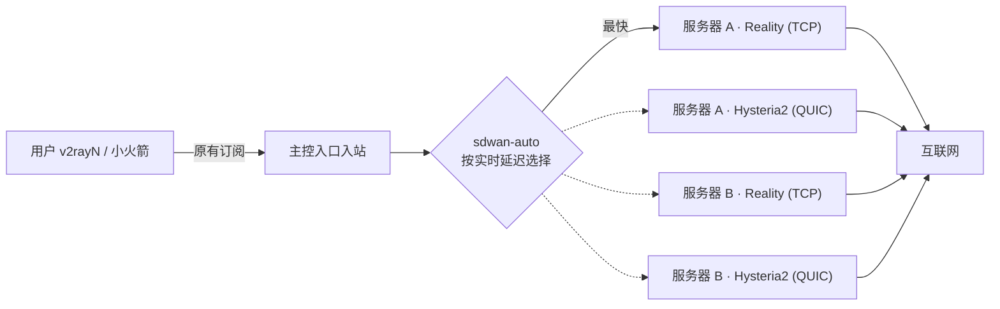

# SD-WAN 智能组网

SD-WAN 把主控和多台受管服务器合并成一张网：用户只连接主控的入口入站（订阅不变），主控在每台服务器上部署专用上行通道，始终通过当前最快、最稳定的通道出网。

## 开启

1. 主控运行在 **完整主控制端**，子服务器通过 Agent 在线并已升级到同一版本。
2. 打开 **SD-WAN 组网**，在「可加入的服务器」中点击 **加入组网**。主控通过 Agent 在该服务器自动创建专用上行入站（`sdwan-uplink-reality`、`sdwan-uplink-hy2`）和内部用户，凭据只保存在主控，不会出现在用户订阅中。
3. 在「组网设置」选择 **入口入站**（哪些入站的用户流量走组网）并启用 **SD-WAN 路由**。
4. 主控生成 `sdwan-auto`（sing-box `urltest`）组，每台服务器的每条通道都是一个候选：按测速间隔持续测量真实出口延迟，只有新通道比当前通道快超过「切换容差」时才切换，避免抖动；当前通道连接失败后，看门狗约 5 秒内强制重测并切换。

## 上行协议

| 上行协议 | 特点 |
| --- | --- |
| 自动（默认，推荐） | 同时部署 Reality 与 Hysteria2 两条通道，自动使用最快的一条，另一条随时顶上；构建或服务器不支持时自动退回 Shadowsocks 2022 |
| VLESS Reality + Vision（TCP） | 最安全：x25519 密钥认证，无需信任任何证书，流量与真实 TLS 1.3 网站无法区分；UDP 被封锁或限速时依然稳定。每台服务器自动探测并选用最快可达的伪装目标网站（也可手动指定） |
| Hysteria2（QUIC） | 长距离、高丢包线路最快：BBR + Salamander 混淆，主控固定信任该服务器自动生成的证书，不跳过校验；需要 UDP |
| Shadowsocks 2022 | 轻量后备方案，没有 TLS 伪装 |

## 选项

| 选项 | 说明 |
| --- | --- |
| Reality 伪装目标网站 | 留空时每台服务器自动选择可达且最快的 TLS 1.3 + HTTP/2 网站 |
| 带宽测试地址 | 检测和一键调优勾选「包含带宽测试」时，通过每条通道下载的文件（每条最多 32 MB） |
| 主控直连也作为候选 | 主控自身直连更快时直接出网 |
| 优先匹配自定义路由规则 | 开启后路由列表中的规则先匹配，未命中的流量再走 SD-WAN；嗅探与 DNS 劫持规则始终先执行 |

## 网络检测与一键调优

- **检测**（只读）：对每条通道采样 5 次，给出延迟中位数、抖动和丢包，可选带宽测试；同时检查主控与每台服务器的内核网络参数、系统时钟偏差（Shadowsocks 2022 超过 30 秒会失效）、上行入站是否在运行、协议是否与设置一致，输出问题清单、可一键修复项和 0–100 健康分。
- **一键调优**：先检测一次，然后自动：
  1. 在主控和所有组网服务器上应用网络内核优化（BBR、fq、TCP Fast Open、MTU 探测、关闭空闲慢启动、按内存调整的大缓冲区），写入 `/etc/sysctl.d/99-1s-ui-sdwan.conf`，重启后仍生效；已经更优的值（如 bbr3、cake、更大的缓冲区）保持不变，内核不支持的项目会如实标注；
  2. 把通道升级为设置中的协议，重建未运行的通道；
  3. 另一条通道正常而本通道不可达时（例如 UDP 被防火墙拦截）将其移出自动选择组，恢复后自动放回；
  4. 按实测抖动调整切换容差，应用配置后再测一次，显示调优前后的健康分与每条通道的对比。
- 检测与调优在后台运行，页面实时显示进度与日志；运行期间暂停其它组网修改。

## 注意

- 受管服务器的防火墙 / 云安全组需放行上行端口：Reality 与 Shadowsocks 为 TCP，Hysteria2 为 UDP。端口自动选在内核临时端口范围之下（默认 20000–32767），不会与出站连接冲突；检测会列出被拦截的端口。
- 旧版本加入的服务器（单条 Shadowsocks 上行）升级后继续可用，卡片提示「重新同步」；点击 **一键调优** 或 **重新同步** 即升级为当前协议。
- 没有启用 SD-WAN 路由时，`sdwan-auto` 组仍会创建并测速，可先观察延迟，也可以在路由列表中手动引用 `sdwan-auto`。
- 移出组网会同时删除该服务器上的全部 `sdwan-uplink-*` 入站、内部用户、自动证书和 Reality 密钥；服务器离线时请在其面板手动删除。
